Dear Mom,

I hope you had a good birthday. I'm sorry that I couldn't send you a card or gift - instead I published this as an invisible page on my website and eventually I can try making it password encrypted (not that anyone would find this link regardless). 

I'm reading exerpts from War and Peace for my Russian Literature class. Tolstoy makes a very interesting argument against the idea that history is written by great men. War and Peace and his writings on history argue that the Napoleonic wars and wars more generally are caused only in a minor part by the leaders. Instead the wars are a result of an uncountable number of individual decisions, analogous to a rockslide triggered by a climber's pickaxe, where the pickaxe blow was more the straw that broke the camel's back. I've been really enjoying this class because without reading the entirety of all of these russian novels (they are LONG!), the discussions and readings give me a good overview and appreciation of Russian literature, which is really central to Russian culture in general.

I think one of the things that makes you an exceptional mom is how you've helped me learn to appreciate the humanities. Whether it was piano, saxophone, reading, or history, you've always encouraged me to find meaning in activities outside of work and socializing. I've come to appreciate this more after coming to MIT, because most students here have only read books that were assigned to them for school and only played music in order to do well in music competitions. It's probably a selection bias because spending time on humanities for their own sake doesn't improve your odds of getting into MIT. Supermath was undoubtedly important for my development as an engineer, but when I look back on my childhood I think that reading classic books like *The Grapes of Wrath*, *1984*, *For Whom the Bell Tolls*, *Guns, Germs, and Steel*, *I, Robot*, *To Kill a Mockingbird*, and *Dune* (in addition to all the less famous scifi and fantasy books I discovered on my own) really helped me grow as a person. I've noticed that I've been able to really enjoy my humanities classes while a lot of my friends have resorted to taking easy classes since they are going to be boring anyway, and I think it's thanks to your encouragement of reading.

I'm also grateful for the emotional support you have always provided. Whenever I talk to you about having a bad day, I can count on you putting my feelings first. I've found that it's a lot easier to work on the hard technical problems when you know that there are people who love you regardless of what grade or job you get.

I love you so much. I can't wait until you guys come back from Europe so that I can spend more time at home :)

Love,
Keiji

<iframe style="border-radius:12px" src="https://open.spotify.com/embed/track/3bsRMvQja4huvPWo1S5ONc?utm_source=generator" width="100%" height="352" frameBorder="0" allowfullscreen="" allow="autoplay; clipboard-write; encrypted-media; fullscreen; picture-in-picture" loading="lazy"></iframe>


  
  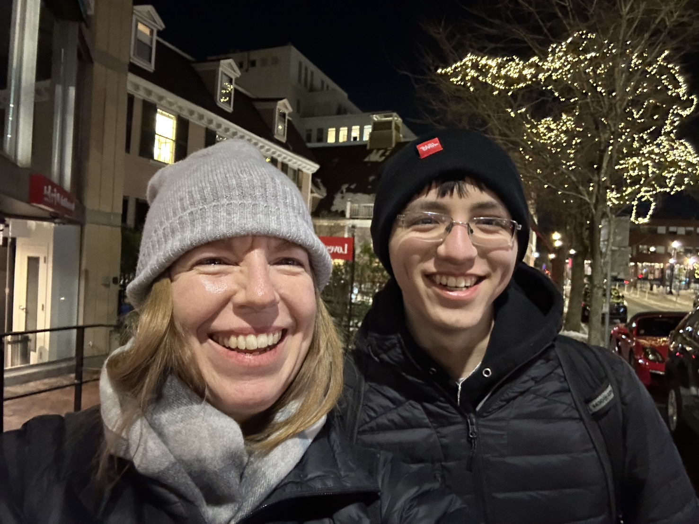
  
  
  
  
  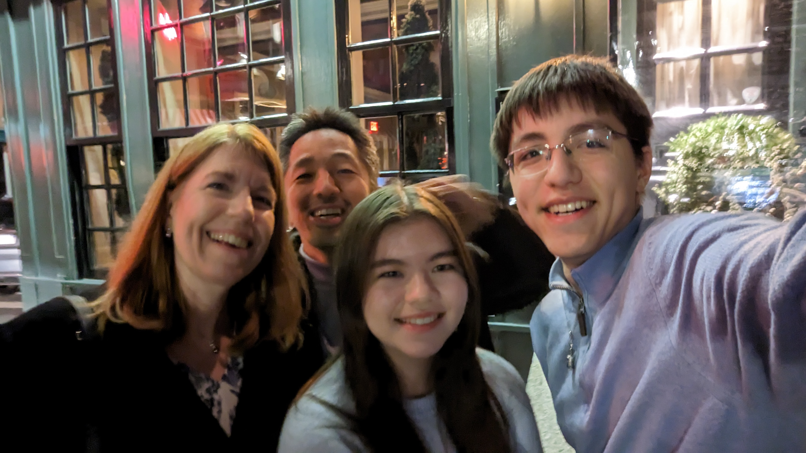
  
  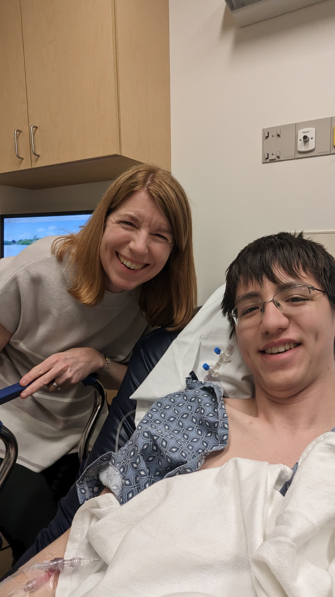
  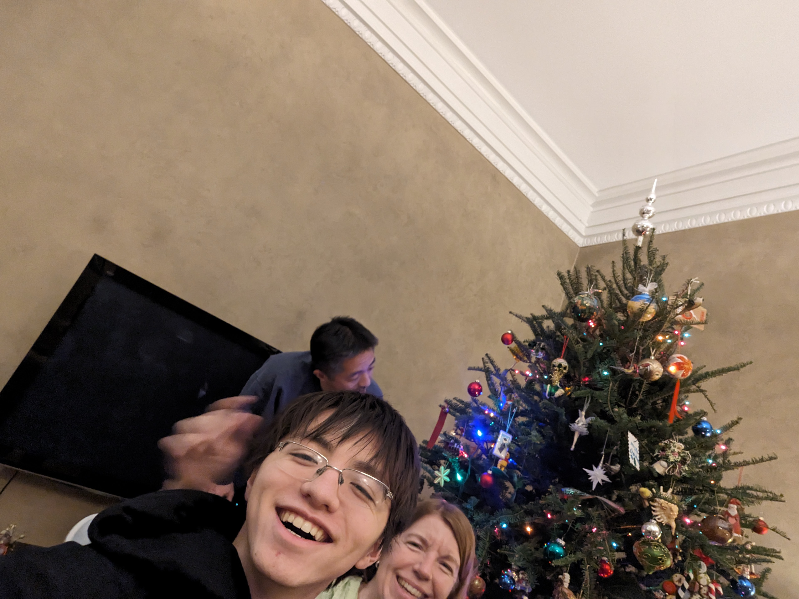
  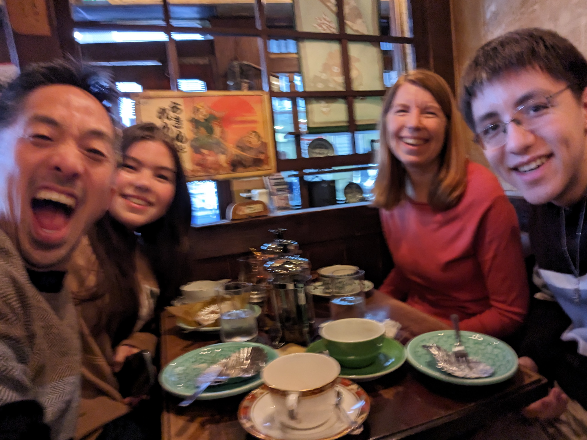
  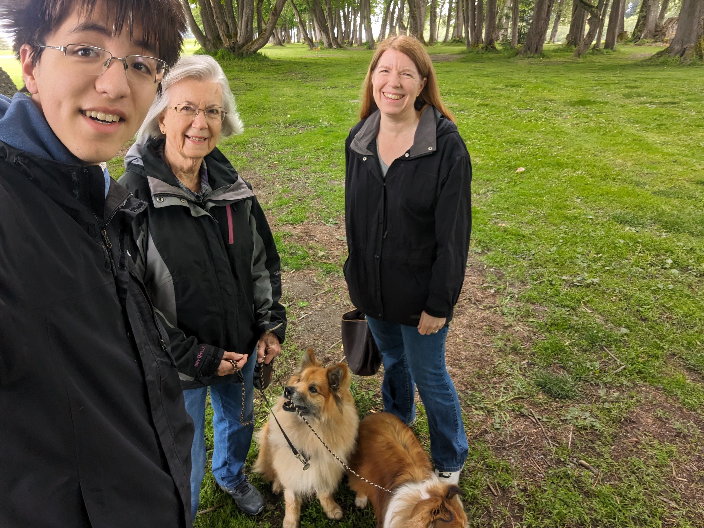
  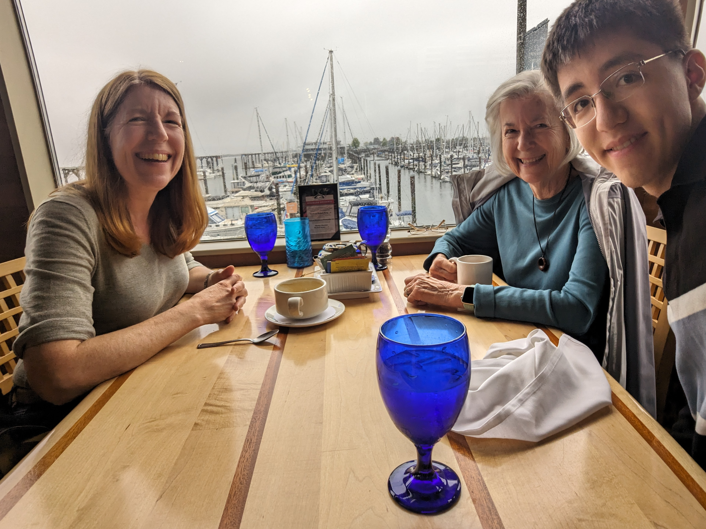
  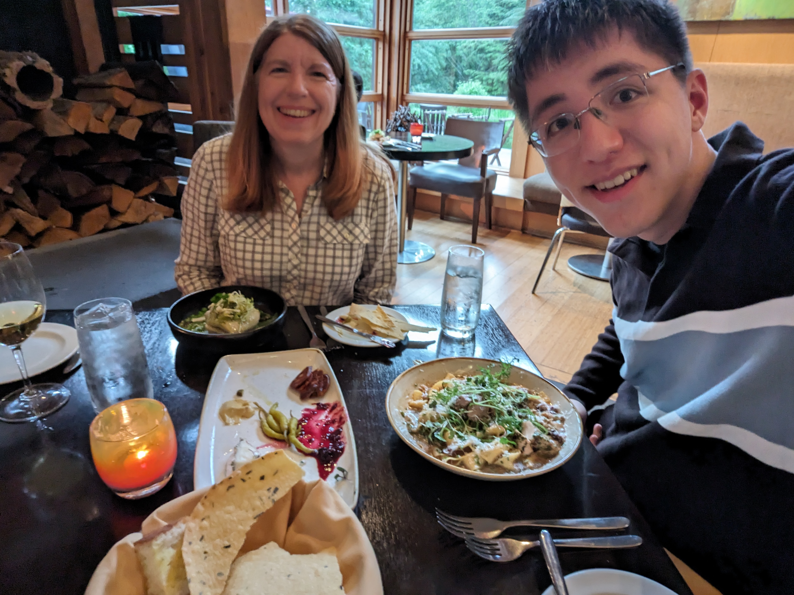
  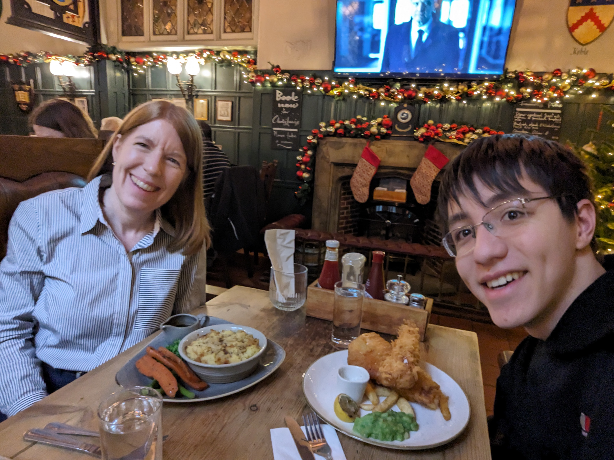
  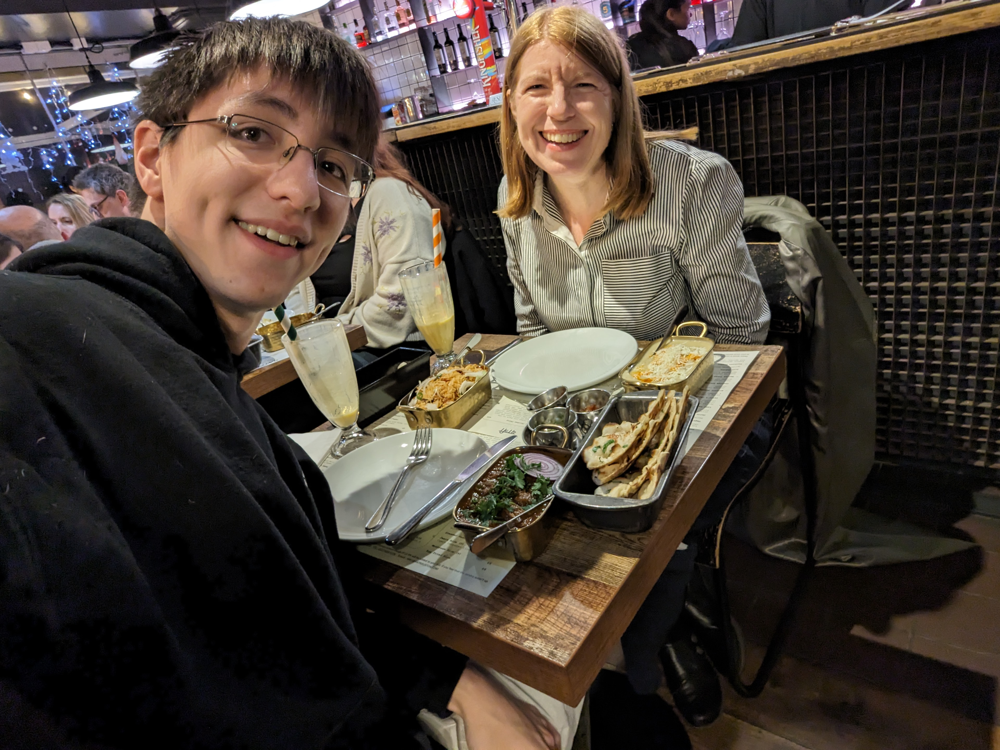
  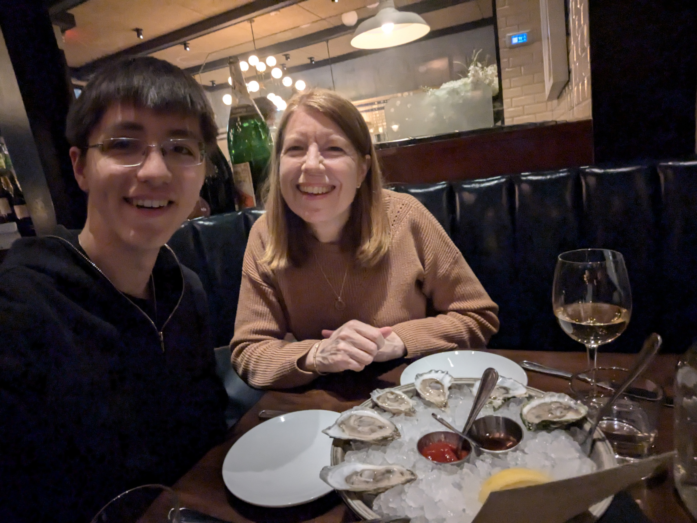

