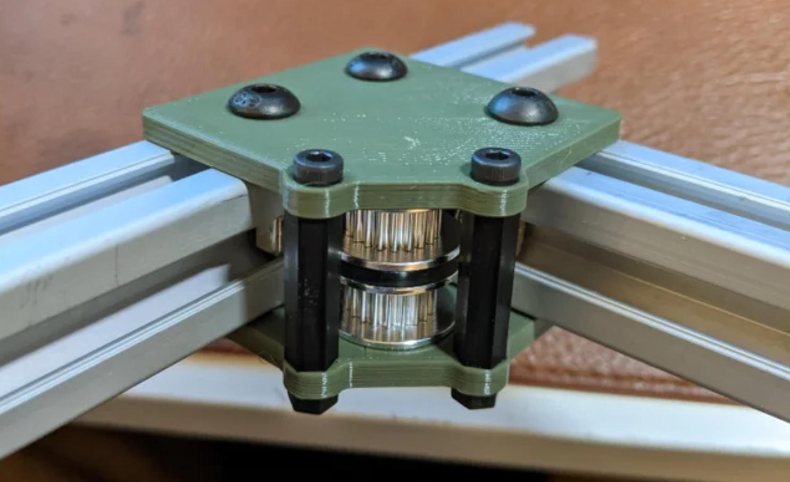

As I described in a [previous post](https://kogappa.com/posts/chessbot/), I applied to ProjX for a robotic chessboard project. I'm teaming up with three friends, Claudius, Eric, and Gloria. We're naming the robot Magnets Carlson, or Mags for short. Here are some updates on how things are going.
 
Here's our [timeline](https://docs.google.com/document/d/1dh9BuBSp1R-42owwGCd5NASiz3Vbetl4lbmRfClhc0c/edit?usp=sharing) and [budget](https://docs.google.com/spreadsheets/d/1yqGCbEJ-lgLs7kG5b4U-4LM2qvh067T2bJkhiu7EdD8/edit?usp=sharing). You can find our (very much work-in-progress) CAD model [here](https://cad.onshape.com/documents/2f3e28006e5b2cd6cd052bed/w/872351ec056974a435282c6c/e/17951daab4fa19d5251dfc0d?renderMode=0&uiState=635e0caafc832d756ab13628). 

## Design
After some brainstorming, we've decided on a really compact corexy gantry design that has a thickness of under 30mm.

With some clever packaging, the height of the pulleys, linear rails, and electromagnet can be parallel to 20x20mm extrusion. The frame would be made with blind joints (easy to make square) and pulley gussets, inspired by this design:

[Source](https://www.reddit.com/r/3Dprinting/comments/jnagd2/working_on_a_new_corexy_printer_design/)

The motors will be connected by a second belt stage for better packaging. It will be easier to see what I mean once we've CADed the whole thing, but we should be able to make a nice and thin board, in contrast to other autonomous chess sets such as the [instructables build](https://www.instructables.com/Automated-Chessboard/):

## Money
We got selected for ProjX funding ($500)! Hopefully we will also get money form the IAP Minigrant. 

I bought some electrical stuff for prototyping:
 - 1x 50N 25*20mm Electromagnet ($15)
 - 1x 40 Pcs Refrigerator Magnets ($12)
 - 1x 12 Pcs Multiplexer ($12)
 - 1x Transistor ($6)
 - 1x Freewheeling Diode ($5)
 - 1x Arduino Uno ($18)
 - 1x Breadboard ($13)
 - 70x Reed Switches ($40)

 Hopefully I will be able to make something cool with this soon.