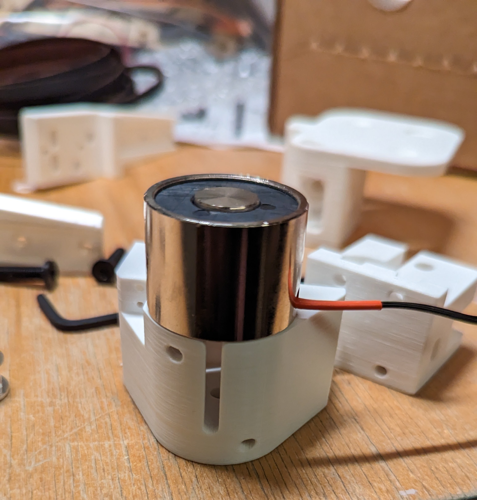
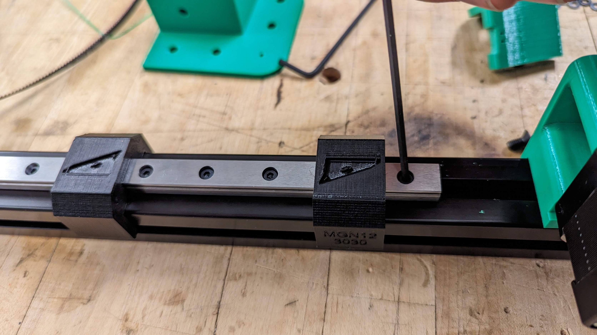
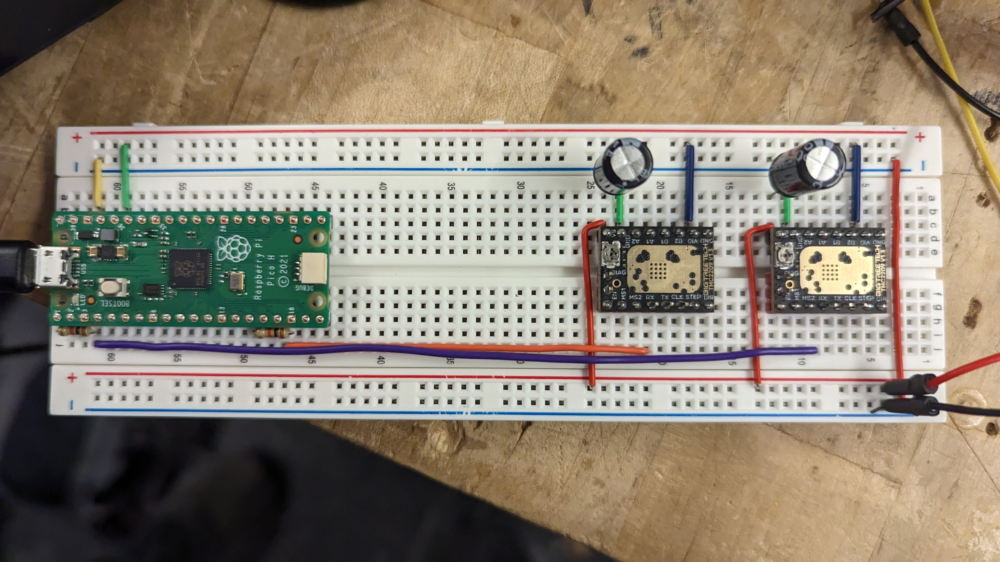

## Introduction

Assembly is harder than it looks. The frame needs to be square, which is not easy because it's huge. The linear rails need to be parallel or the the gantry will bind up. The x-axis rail needs to be perpendicular to the y-axis linear rails as well.

## Manufacturing

First we 3D printed the parts. I reprinted them at least 4 times due to small design flaws (overoptimistic clearances, holes that were the wrong size, etc). 

Oops.

We ordered the extrusion from Misumi. They face both ends of the extrusion to length such that opposite sides are exactly the same length. This is really important for making the frame square. They also machine tap the ends of the extrusion which is nice. 

We made blind joints with M8 button head bolts. This is the easiest way to make a perpendicular joint.

First we drilled access holes in the extrusion with a simple jig:

The blind joint looks like this:

## Frame

The frame needs to be square if we want the gantry to be smooth. We don't want a parallelogram. We also need the extrusion to be flat. We assembled the frame on the MIT Motorsports welding table because it's really flat. 

### Joint Assembly
1. Tighten the bolt enough that it resists movement
2. Adjust the extrusion with a machinist square until it's perpendicular
3. Tighten the bolt completely while holding down the frame

Step 2 is tricky because it's easy to overshoot. You can tell if it's square by feeling the edge between the extrusions with your finger. Step 3 is hard because tightening the bolt will make the extrusion want to rotate (with a lot of mechanical advantage). If the extrusion is even slightly angled, the gantry will rack because of how far apart the linear rails are.

## Gantry

The square frame only guarantees that the linear rails will be parallel in one axis. When we assemble the rails we need to make sure that the other two axes are also parallel. 

### Y-Axis Assembly
1. Use aligners to straighten one rail and tighten it completely
2. Tighten second rail loosely while using aligners to straighten it
3. Assemble the x-axis to both rails
4. Move the x-axis back and forth to straighten the loose rail
5. Finish tightening the second rail once the rails move smoothly

These are the aligners we used to straighten the linear rails. We borrowed the CAD from the RatRig.

### X-Axis Assembly
1. Assemble x-axis
2. Weave belt runs through pulleys and attach them at the tensioners
3. Tension one belt
4. Move carriage to the center bottom and tension the other belt until the x-axis is perpendicular to the y-axis

The Zyltech linear rails we bought slide quite nicely (especially for only $20). We were careful not to let the carriage reach the edge so the balls don't fall out.

We tension the belts by tightening a bolt which pulls a captured nut attached to the belt. Our belt tensioning procedure straightens the x-axis which makes the gantry smoother. 

## Action

We wired up the electronics to get the motors running. We are using a RaspberryPi 4B, RaspberryPi Pico, and TMC2209s. We used the 3D printer firmware Klipper to control the motors.

The motors are fast!


We tested the electromagnet under the carbon fiber board and it worked really well. 


Next we will take everything apart and reassemble with new Formlabs Fuse 1 parts.