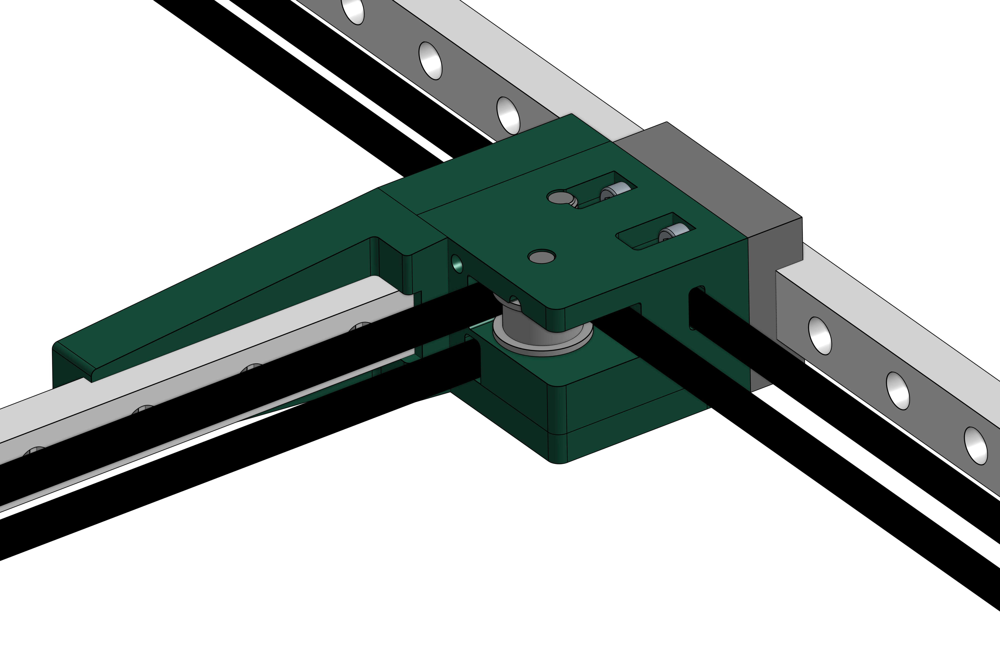
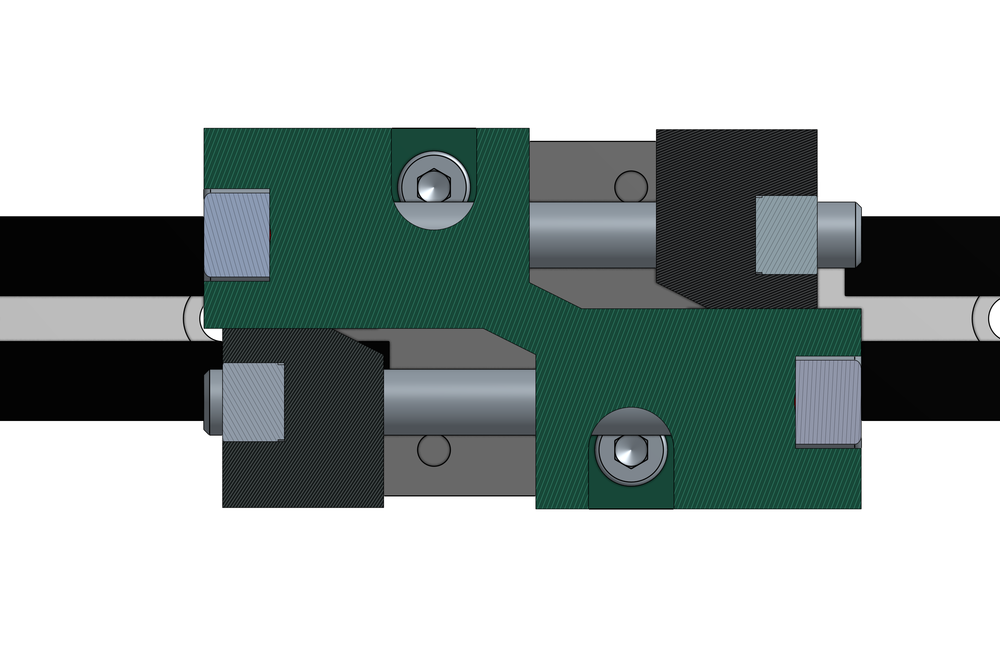
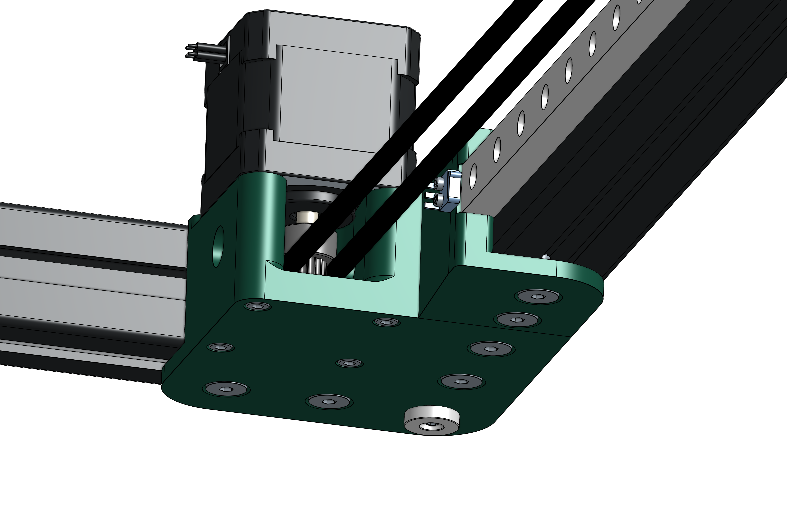
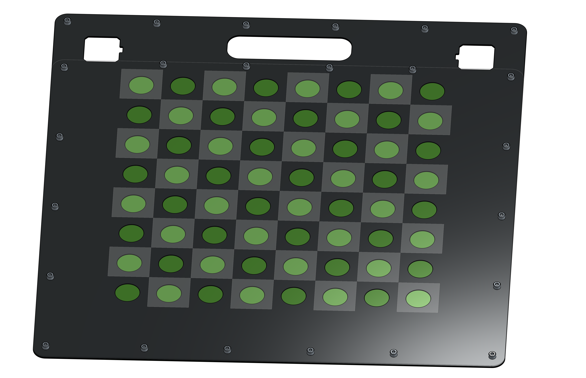

If you haven't read the previous posts on this project, the tldr is that I'm building a chess robot named Mags that moves pieces around using an electromagnet underneath the board.

My friends and I finally finished the first CAD iteration of Mags.

If you want to take a closer look, check out our CAD. Here's the [Onshape link](https://cad.onshape.com/documents/2f3e28006e5b2cd6cd052bed/w/872351ec056974a435282c6c/e/d98ee53972011595aca895ee?renderMode=0&uiState=63a8d003fba71615002ed49d).

## Design Objectives
I'll begin with our overarching objectives. 

I want to build something better than what already exists. Some issues with [existing robotic chess boards](https://squareoffnow.com/product/gks) are:
 - **Piece detection**: Magnetic piece detection is invisible and more reliable than touch sensors used by some boards
 - **Compactness**: Robotic chessboards I've seen are at least 80mm thick. Mags should be thin.
 - **Aesthetics**: Most robotic chessboards look like a normal chess set. But I want Mags should look more modern. 
 - **Speed**: I like things that move fast. Mags should be quick.
 - **Personality**: Playing chess against a robot should be fun. Mags could offer takebacks and advice in easy mode, and roast you in hustler mode.

Next I'll talk about the design choices that address these issues. 

## Exterior

Mags looks very different from other robotic boards:
 - **Flipped motors**: Reduces thickness to 40 mm and gives us space for bigger motors.
 - **Touchscreen**: Gives Mags personality. You can request takebacks and Mags can tell you how bad your moves are.
 - **Carbon fiber board**: Way cooler (and stiffer) than wood veneer. The squares will be on a vinyl sheet, which helps keep the playing surface flat.
 - **3030 Extrusion frame**: Easy to iterate quickly with. By tapping the ends, we can (relatively) easily make a stiff and square  frame. 2020 extrusion is too small. We tried.

## Gantry

Mags is basically a simplified 3D printer. Instead of a hotend, it has an electromagnet. So we modified the gantry design of high performance 3D printers ([RatRig](https://v-core.ratrig.com/), [Voron](https://vorondesign.com/), [VZ-Bot](https://github.com/VzBoT3D/VzBoT-Vz330)) to fit in a 30mm tall frame. 

Here are the notable design choices:
 - **MGN12C Linear Rails**: Compact, stiff, and smooth. 27mm tall is the perfect height for 3030 extrusion. Expensive but worth it.
 - **CoreXY**: Moving parts are lightweight. Two tensioners on the carriage can straighten the X-axis. 
 - **3D printed parts**: Fast iteration. Enables compact and complicated parts.
 - **Raspi Pico**: Controls motors using Klipper (which doesn't work on Teensies). Klipper is awesome.

## Closeups
In this section I'll write about the more subtle design choices.
### Pulley Block

The pulley block connects the x-axis to the y-axis and houses two pulleys. The assembly is split into three 3D-printed parts, the pulley block (isolated in the image below), the rail mount (the long piece that bolts to the x-rail), and the lid (the flat part on top). 

The rail mount is a separate part so that we can print it flat on the bed for strength and dimensional accuracy. The lid allows us to assemble the top pulley without cantilevering it. The parts are precisely located to eachother with press-fit dowel pins. This is important because we want the rails to be as perpendicular as possible.

This is the right pulley block.

Look familiar? The parts on both sides are identical. I CADed both sides separately before realizing this.

### Carriage

The carriage has two belt tensioners, an electromagnet, and a limit switch. We found a super cute limit switch called the "DH Ultraminiature". The belt tensioners needed some really funky geometry to fit in such a small space:

This is going to be a pain to assemble. 

### Corner Mount

The corner mount is simple. It extends below the 3030 so that we can line it up perfectly. In the corner we have little rubber feet to dampen vibrations. 

### Motor Mount

The motor mount is also simple. There is a separate end stop part that holds the limit switch. The parts are mirrored on the other side and the timing pulley is flipped upside down.

### Board

The board has three layers. On top we have a 2mm thick carbon fiber sheet. The white squares are vinyled on. We'll waterjet the carbon fiber and get the vinyl printed for us.

I've made the carbon fiber sheet transparent in this image, revealing a 1/32" delrin sheet with circular holes. This acts as a spacer for the SMD hall-effect components on the PCB.

On the bottom layer, we have more delrin spacers and four 0.8x100x400mm PCBs. These PCBs detect which squares have pieces on them. Each PCB contains sixteen hall-effect sensors and a multiplexor breakout board.

## Summary

We've now designed a cool chess robot, but actually building it will be hard. I'll order parts by the beginning of IAP (MIT's january term) so that we can hit the ground running with manufacturing and assembly. 