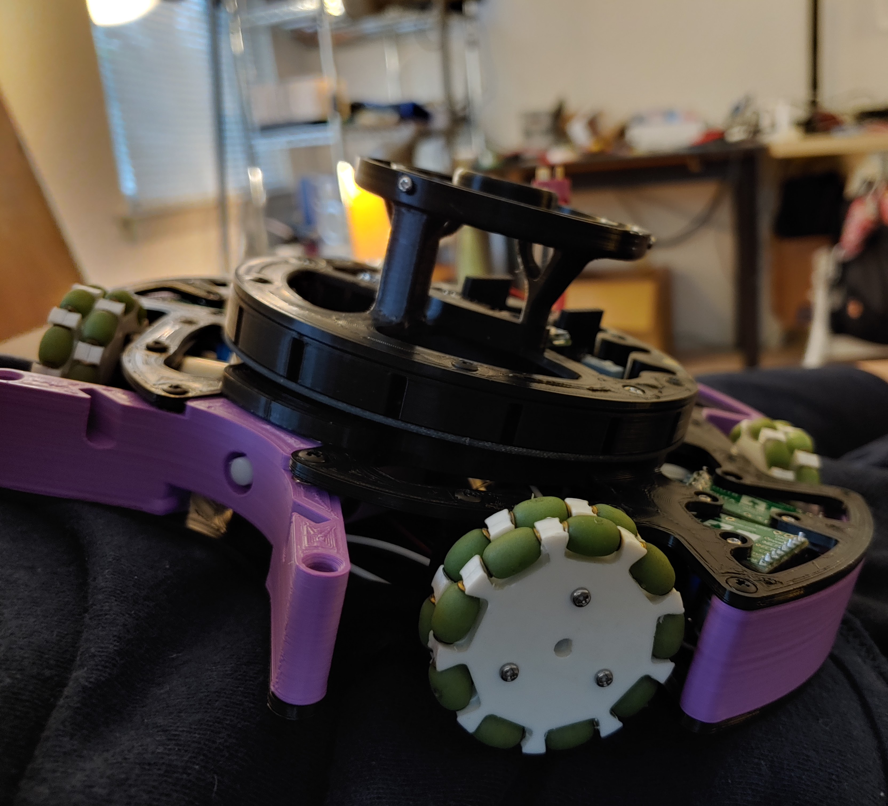

You probably haven't heard of RoboCupJunior (RCJ) before. This makes me sad. It's a super cool high school robotics competition. Let me explain how it works:
## Rules:
 - Robots play 2v2 soccer autonomously
 - Robots that go out of bounds are removed from play for a minute
 - Up to 4 people per team

RCJ Soccer has two subdivisions, Lightweight and Open:

### Lightweight Division
 - Weight Limit: 1.1 kg
 - Size Limit: 22 cm diameter
 - Infrared emitting ball (easy to detect with IR sensors)
 - [Example Gameplay](https://www.youtube.com/watch?v=3Gupdy-QfdE)

### Open Division (2022 rules)
 - Weight Limit: 2.2 kg
 - Size Limit: 18 cm diameter
 - Golf ball
 - [Example Gameplay from 2019](https://www.youtube.com/watch?v=41FFGBlrU1k)

I'll start by summarizing my experience doing RoboCup in high school.

 ## My RCJ Journey
My friend Mark Ogata and I started a RoboCupJunior team back in 8th grade (2017). I built this monstrosity out of store-bought electrical components and hand-cut acrylic. We competed in the lightweight division. 

")

We didn't just get clapped. We *own-goaled*. I don't want to talk about it.

In 9th grade, we won US nationals and qualify for the world cup in Sydney, Australia. This time, my robot managed to score in the right goal.

We flew to Sydney. And got demolished. But while we were getting our butts kicked, we couldn't help but be inspired by our opponents. Here's a photo of team LEGEND's robots (representing Japan). 

Notice the custom PCBs, CNCed carbon fiber, and low center of gravity. LEGEND was the only lightweight division team to have a kicker, dribbler, and omnidirectional camera (there's an upside-down conical mirror that allows the robot to see the whole field).

I decided to specialize in mechanical engineering. I applied to Maxon's Young Engineer's Program and they generously provided us with with DCX19 motors. These motors are insane. Our initial robot was simple, but we began designing our own PCBs and parts.

I added a kicker in our next major design iteration. It's a 10 Ohm solenoid hooked up to a 60V boost circuit which was just enough to reach the kicker power limit. We tried saving weight by replacing the steel solenoid casing with plastic, but apparently the steel is critical to the power of the solenoid's magnetic field. To our dismay, the COVID pandemic cancelled RoboCup 2020. But we got a surprise boost of inspiration from team Transcendence from Singapore, who made an excellent [website](https://bozo.infocommsociety.com/) documenting their robot.

V4 included an omnidirectional camera. I redesigned the omniwheels and 3D printed everything in carbon fiber nylon to save weight. I ended up spending a ton of time upgrading my CR10 3D printer (All-metal E3D V6 hotend, SKR1.4 board, TMC2209 drivers, dual lead screw, Zesty sidewinder remote direct drive, improved firmware). 

Next, I added a dribbler, like LEGEND's robots at Sydney. The dribbler was spring-loaded and could maintain of control of the ball and absorb impacts. The hardest part was staying under the weight limit of 1100 grams. By redesigning my omniwheels again, I reduced their weight from 24 grams to just 12 grams each.

# Why RCJ Is Great
