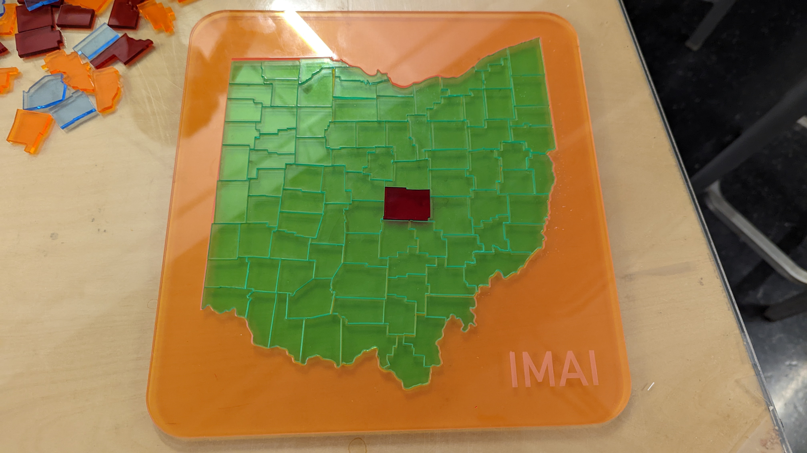
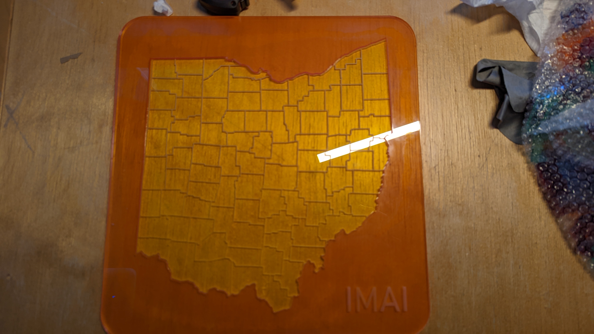

My dad developed a [cool statistical method](https://news.harvard.edu/gazette/story/2022/11/an-algorithm-to-detect-gerrymandering/) and used it to prove that politicians discriminated through gerrymandering in several court cases. So as a Christmas gift, I made him a gerrymandering puzzle. I lasercut the parts out of acrylic with help from Gloria, and Claudius helped me glue the box together.

## The Puzzle

Each piece is a county of Ohio. The puzzle is a lot harder than it looks. There are four complete sets of pieces in different colors. The base is inscribed with lines so that the puzzle isn't pure hell.

We used an svg of the Ohio counties from Wikipedia to lasercut the pieces. We made the base by lasercutting two acrylic plates and gluing them together. The super glue dried in literally half a second. This made the two plates being slightly misaligned. Even worse, the superglue left a nasty smear in between the plates. 

Lessons learned:
 - Engraving is slow (the base took 1.5 hours)
 - Use opaque acrylic with superglue
 - Superglue dries super quick between large flat surfaces. Align carefully.

## The Box

I first tried making the box out of scrap plywood. It was ugly and the pieces didn't fit.

I made a new box using acrylic. It's bigger and the corners are differently colored to match the pieces. "redist" is engraved on the lid. We superglued opposite corners first to make the box as square as we could because the tolerances were pretty loose. I'm really happy with how it came out. 

## The Game

There are a few ways you can play:

VS: Each player gets a color. Everyone tries to play as many pieces as they can. The person who placed the most pieces when the puzzle is complete wins.

The three of us got demolished by Claudius (green).

Coop: The Four Color Theorem says that any map can be colored with only four colors such that no two adjacent regions have the same color. Fill out the puzzle so that no two adjacent pieces have the same color.

This took my dad, my sister, and I over an hour. To satisfy the four color rule we had to redo entire sections of the map. The best strategy is to figure out which piece you need *and then* look for it. If you choose a piece and then try to find its spot it'll take forever. 

## Conclusion
Making custom puzzles is pretty easy and fun. I like making my own presents. There's something special about seeing something I made giving joy to others.  