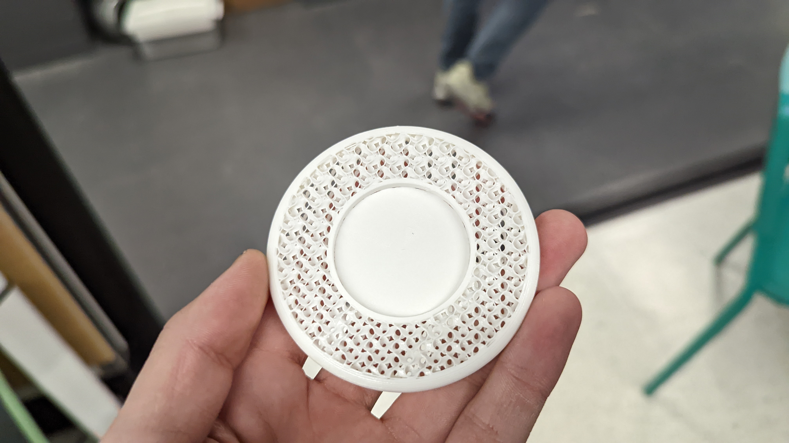
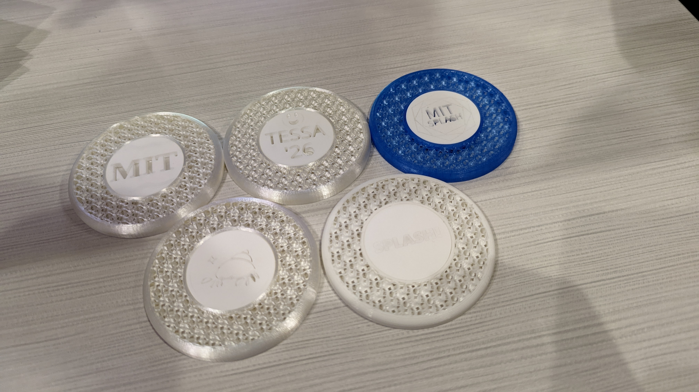
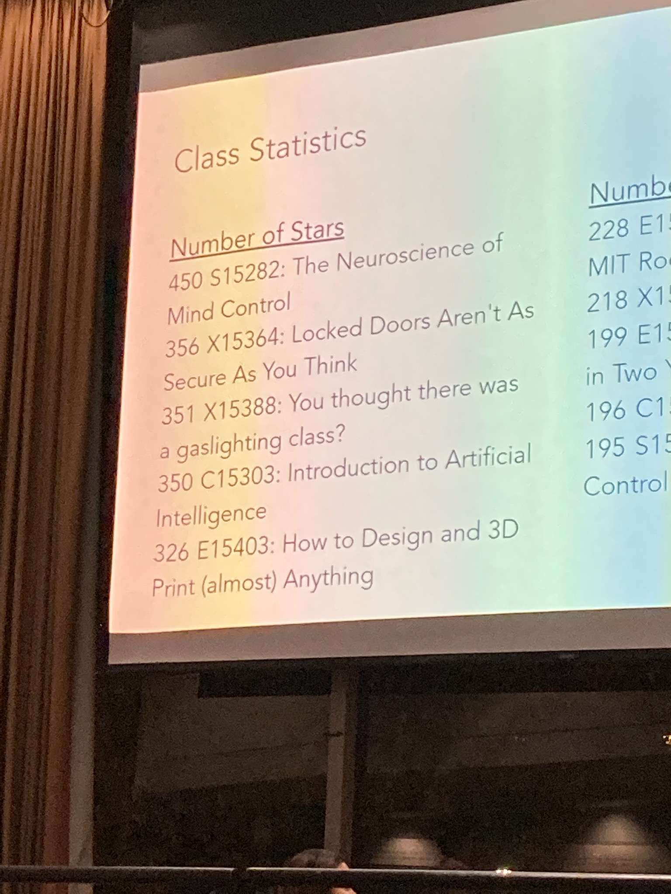

Every year, MIT students run a really cool event called [Splash](https://esp.mit.edu/learn/Splash/index.html). In one weekend, 2000 high schoolers come to MIT, where they choose from 500 classes taught by 400 college students in the area. Some classes from this year were:
 - "Opening locks and doors"
 - "How to fail AP Computer Science"
 - "Introduction to Minecraft Speedrunning"
 - "So you want to be an astronaut"

Check out the whole class catalog [here](https://esp.mit.edu/learn/Splash/2022/catalog).

Claudius, Gloria, and I taught a class called "How to Design and 3D Print (almost) Anything". 

## Planning

We wanted to teach CAD and 3D printing as well as possible in just 3 hours. We kept the class size small (10) so that we could make sure everyone had a great experience. Onshape was an easy choice for CAD software because it's easy to set up and learn. 

We wanted to manufacture something that our students designed. At first our plan was to 3D print their designs, but that would take too much time so instead we 3D printed coasters in advance and lasercut the students designs during the class.

The 3D printed coasters are easy to CAD and we used gyroid infill to make it look really cool.

Here's our [lesson plan](https://docs.google.com/document/d/1XVa7ItdFy6fospJ-ox6wwEgAug1G8FUFJRDCtE_za9s/edit?usp=sharing) and our [slides](https://docs.google.com/presentation/d/1WpeDzfjWGMT3YGSF8aeZ9FFo6ZFaLheqv-Ro-2Sl0sQ/edit?usp=sharing). 

The slides cover manufacturing methods and how to design for 3D printing. Check them out! We have super satisfying manufacturing montages.

## Teaching

Teaching CAD is all about hands-on experience. So we spent as little time lecturing as possible so that our students were CADing for most of the class. We gave them CAD challenges of increasing difficulty and helped them when they got stuck and answered their questions. Our high teacher to student ratio (1:2) allowed us to have a lot of one-on-one time. Although we had 10 sign ups, only 6 students showed up. But if all 10 had showed up, we probably wouldn't have finished in time, so maybe we got lucky. 

The most challenging CAD challenge was the pencil, but all of our students were able to figure it out eventually. It's tricky because you need to sketch in multiple planes, use both extrude and revolve, and subtract material. 

Everyone was also able to CAD the toaster and a custom design on the centerpiece. Gloria went to lasercut the centerpieces, but we didn't finish lasercutting until 5 min before Splash ended. So I biked over to N51 and grabbed the parts, then biked back as fast as I could and delivered the parts at 5:59. 

The picture didn't come out well because the engraved patterns on the opaque acrylic are subtle. They looked good in person though.

## Conclusion

Our class was awesome. Our students loved it and learned a lot. Planning could have been better but in the end everyone got their parts and we covered all the material. We even ranked 5th among all classes despite having only 6 students! To be fair I have no clue how the star system works.

