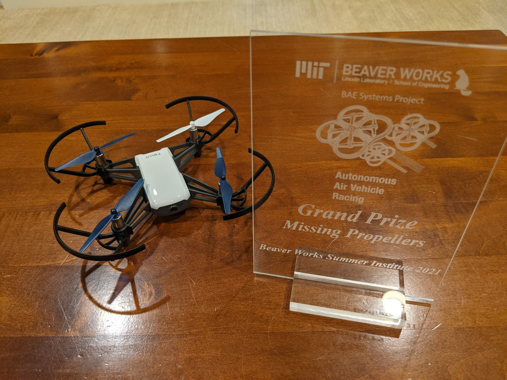
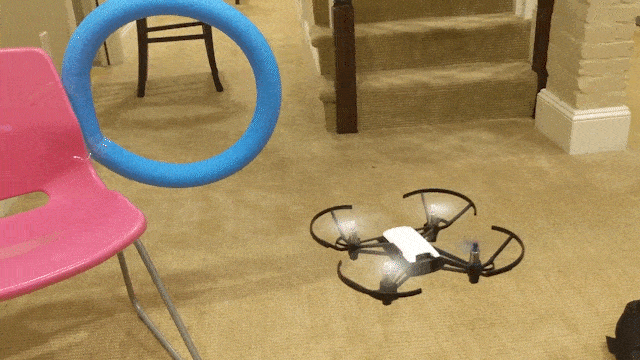
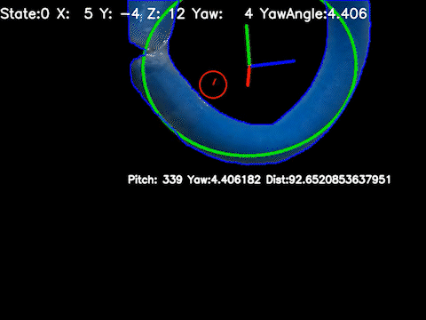
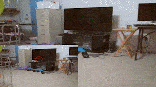

As our [MIT BeaverWorks Summer Insitute](https://beaverworks.ll.mit.edu/CMS/bw/bwsi) final project in 2021, Nandini Bezwada, Michelle Wang, and I programmed drones to fly through colored hoops autonomously. Our project won the best final project award.

We used OpenCV's solvePnP function to project 2D pixels into 3 dimensions. The drone positions itself using four PID controllers for x, y, z, and yaw. 

The drone records footage of its flights so that we can replay what it saw before crashes.

The drone also records footage with a debugger overlay which displays the color filter, ellipse fitting, solvePnP axes, and variables. The debugger helped us determine the root cause of every crash.

For more details, see our presentation video:
https://www.youtube.com/watch?v=lFV6kygEo7g