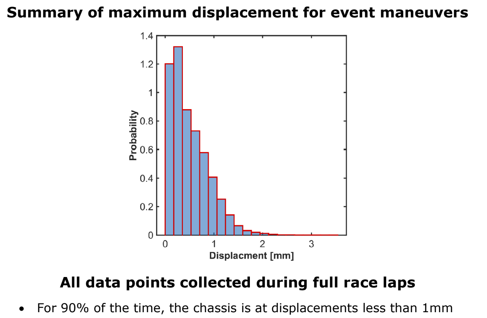
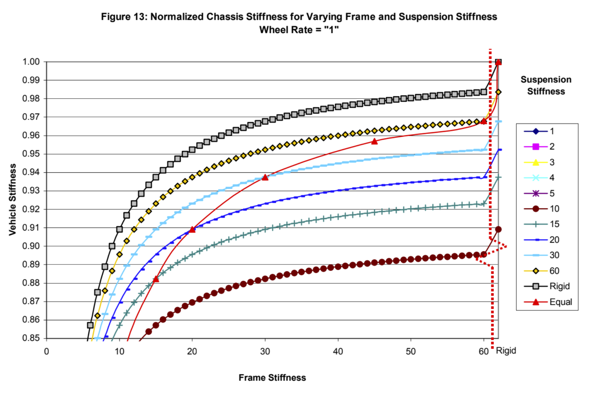
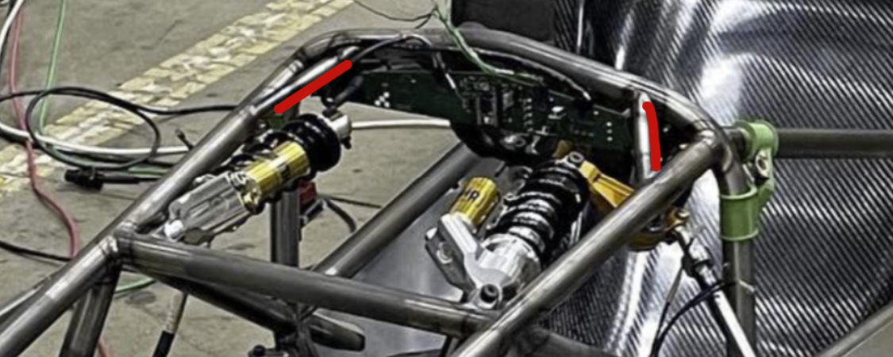
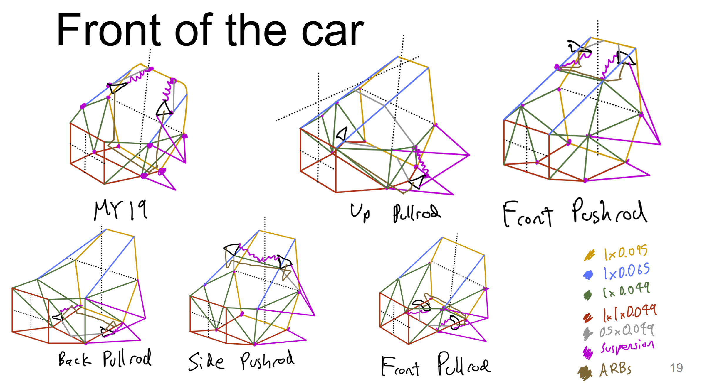
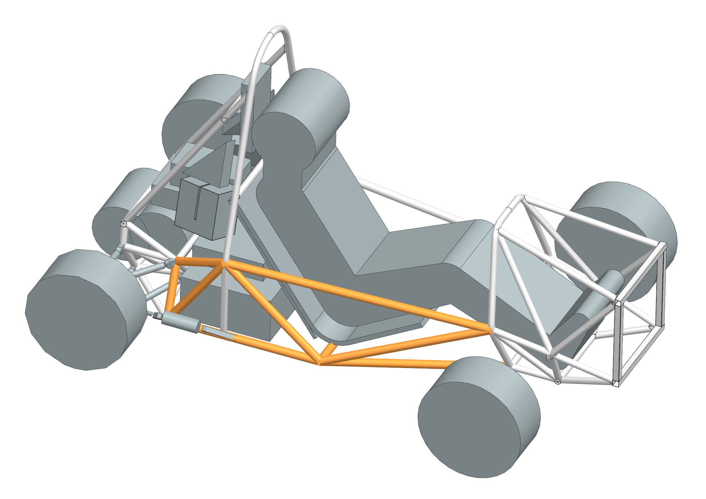
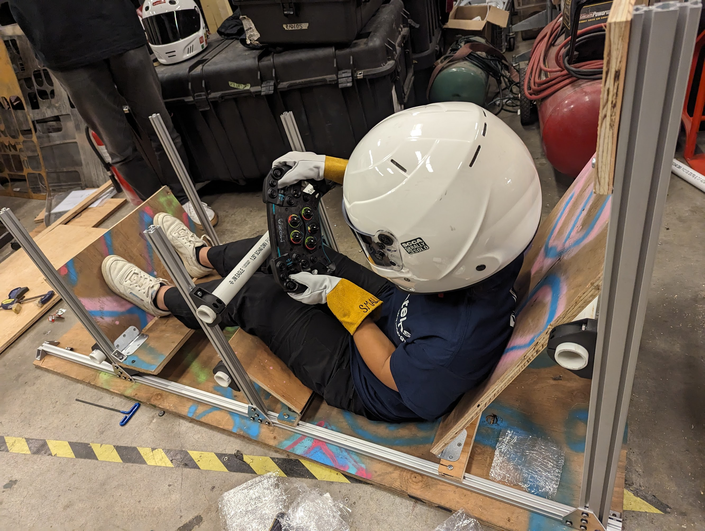

## Introduction
As chassis, packaging, and frame lead for [MIT Motorsports](https://fsae.mit.edu/), I'm designing and building a steel space frame for this year's car.

## Research

The first step was to do research on space frames to better understand how to design them. The best resources I found were:
 - Bill Riley's [Design, Analasys, and Testing of a Formula SAE Car Chassis](https://www.researchgate.net/publication/267937654_2002-01-3300_Design_Analysis_and_Testing_of_a_Formula_SAE_Car_Chassis)
 - [The Effect of Chassis Stiffness on RaceCar Handling Balance](https://www.academia.edu/32672830/The_Effect_of_Chassis_Stiffness_on_Race_Car_Handling_Balance)
 - Oliver Macneely's [Design and Analysis of a Monocoque Chassis for an Electric Formula SAE Vehicle](https://dspace.mit.edu/handle/1721.1/147426?show=full)
 - Race Car Vehicle Dynamics by Milliken and Milliken
 - Tune to Win by Carrol Smith

## Design Requirements

Making good design requirements is extremely important because they drive all the engineering decisions that follow. 

To make my design requirements less dumb, I had a Design Requirements Design Review (DRDR) to explain each of my requirements and get feedback. Here are my [DRDR slides](https://docs.google.com/presentation/d/1_s_QFdtZt-JtposlAiHCz1c1DveoeQGZ/edit?usp=sharing&ouid=112501746677842811980&rtpof=true&sd=true) (I've since learned how to make better design review slides :). 

As I progress through the design cycle, I continue to question and modify these requirements.

| Requirement              | Metric                                                                      | Priority |
|--------------------------|-----------------------------------------------------------------------------|----------|
| Extremely Rules Legal    | Pass Structural Equivalency Spreadsheet (SES) and mechanical inspection     | Critical |
| Ergonomics               | Front wing endplates visible, drivable without harness, full elbow movement | High     |
| Center of Gravity Height | Measured < 12"                                                              | High     |
| Rear Weight Bias         | Measured > 52%                                                              | Mid      |
| Mass                     | Measured < 30 kg                                                            | Mid      |
| Torsional Stiffness      | Measured > 1900 Nm/deg                                                      | Mid      |
| Accuracy                 | +- 0.01” suspension points, all tabs must fit                               | Low      |
| Modal Analysis           | 2x greater natural frequency than 65 mph wheel cyclic loading               | Low      |
| Accessibility            | Removal time for relevant subsystems                                        | Low      |

### Justification

Every design requirement should be driven by our team goals. This year, that is placing top 10 at competition. This requires a 4.2 second accel run (75 meter spring), 5.2 second skidpad (steady-state cornering), and 1620 second endurance (22 km autocross race).

#### Mass

According to our simulations, every kilogram of weight saved gives us an additional point at competition. Based on our past cars and their torsional stiffnesses (our best frame was 29 kg and 1912 Nm/deg), under 30 kilograms seems like a feasible weight that would meet our performance requirements. 

#### Stiffness

MY19's frame was measured to be 29 kg and 1912 Nm/deg and load cell testing showed that its displacement was under 1 mm for 90% of the time. This has a negligible impact on suspension handling.

Figure 12 from [Bill Riley's paper](https://www.researchgate.net/publication/267937654_2002-01-3300_Design_Analysis_and_Testing_of_a_Formula_SAE_Car_Chassis) shows the relationship of suspension stiffness on the point of diminishing returns for frame stiffness. MY19's roll stiffness (721 Nm/deg) is 22x greater than its wheel rate (32.3 N/mm), so a 1900 Nm/deg frame (60x wheel rate) results in over 0.93 vehicle stiffness. Beyond this frame stiffness there diminishing returns as almost all of the deflection will be in the suspension.

## Concept Selection

I sketched the viable design archetectures next. I then proposed a concept for the Concept Design Review. Here are my [CoDR slides](https://docs.google.com/presentation/d/18RmqpruyVm-Vr8MNB-Cd666L07yaRMq-xGqe2pHarT0/edit?usp=sharing).

### Bending calcs
I did some hand calcs to determine whether putting frame tubes in bending is acceptable. 

With a simple beam bending calculation, I determined that suspension points putting tubes in bending creates 2 mm of deflection, which is unacceptable considering that the entire frame should deflect less than 1 mm for optimal suspension performance.

We calculated the impact of triangulation on stiffness with a matlab script. The result was shocking - having tension/compression load paths can make structures 5 to 100 times stiffer.

The takeaway from this calculation is that small unregulated tubes for triangulation (highlighted red below) add an enormous amount of stiffness to the frame for a very small weight penalty.

### Front Packaging

I'll describe how I decided between front packaging archetectures as an example of how I made design decisions.

Sketching allowed me to make tradeoffs between the packaging and load paths of various suspension geometries.

I compiled the advantages and disadvantages into the following pugh chart.

I chose the back pullrod configuration primarily because
 - it directs forces into the direction that the frame is stiffest
 - pullrods are loaded in tension which eliminates the eccentric buckling failure mode that pushrods have

## Design

I'm currently designing the frame, starting with spacefill CAD for packaging all the systems on the car.

I am responsbile for packaging of systems. Here is my spacefill CAD for the halfshaft and rear suspension. I'm proud of how the rocker is mounted to a very well supported node at the corner of the battery and the forces on the shocks are almost parallel with the longitudinal tubes they are mounted to. This design allows for the load paths to be in tension and compression, not bending, which makes the frame much stiffer.

Instead of using 1" diameter, 0.065" thick tubes for the side impact structure, I am using 1.25" diameter, 0.049" thick tubes because for the same cross sectional area (tensile strength + weight), the larger tubes have 60% heigher EI (bending stiffness). 

The two highlighted sections of the frame are planar so that they can be jigged and welded flat, which will make building the frame much easier.

We optimized seat angles, pedal positions, steering wheel position, and more with an ergonomics jig.

We are also working on measuring the torsional stiffness of a previously built frame with a "torsionator". This will be used to empirically validate my Finite Element Analysis (FEA) so that we can confidently hit the design requirement for torsional stiffness.

