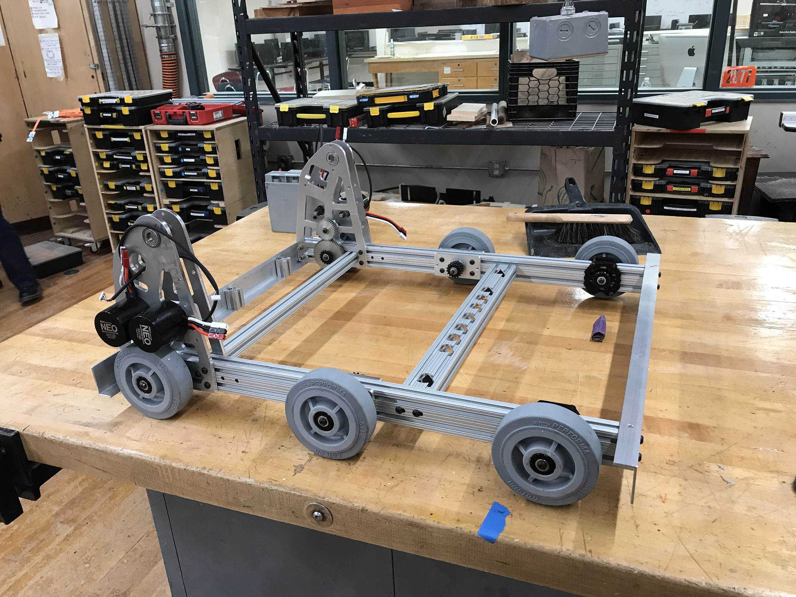
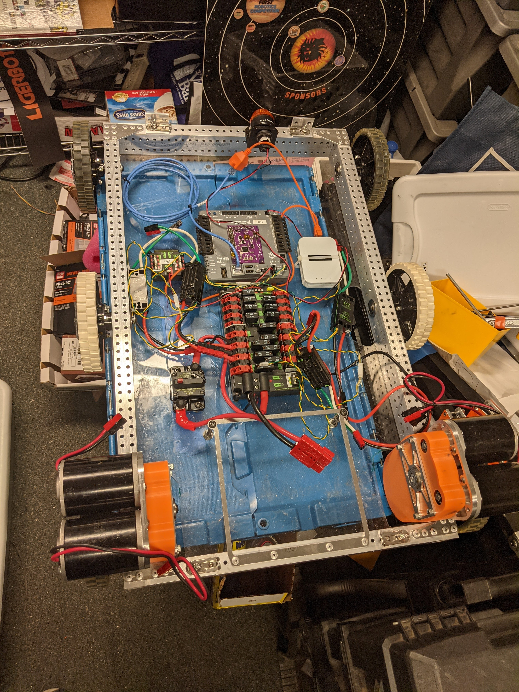
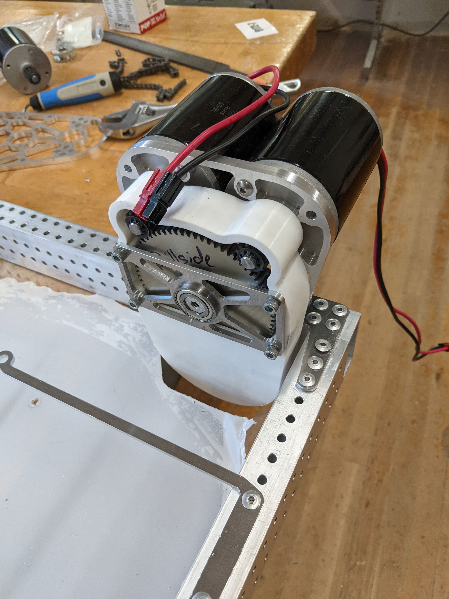

# LigerBots 

My high school's FIRST Robotics Competition (FRC) team was the LigerBots 2877. I was addicted to FRC ever since I saw my first FRC robot as a freshman. I taught myself how to CAD in PTC Creo in my first year, and then Onshape when the team switched CAD software. Although I designed countless mechanisms for CADathons and practice, I only had the opportunity to build a few of them.

I was elected Chief Technical Officer for my junior year, while everything was remote due to the pandemic. As CTO, I transitioned the team from 8020 extrusion to CNCed box tubing construction and began a CAD training curriculum.

## Chain-in-tube Drivetrain

Up to 2020, our robots were constructed with 8020 extrusion as shown below. 

This is great for teams that have limited manufacturing and CAD capabilities, but box tubing can be lighter, stronger, and more versatile. 

I researched how other teams used box tubing, and led an offseason drivetrain project using CNCed box tubing. Since we had extremely limited shop access due to the pandemic, I reached out to a company that generously manufactured our tubes for free. 

In my design, all six wheels are driven by chain which is packaged inside of the box tubing. This design makes chain tensioning unnecessary because the tube fully constrains the chain. In addition to box tube construction, I introduced rivets to the team (we had only used bolts previously).

The gearboxes were designed entirely by new members. I taught them how to CAD over zoom and led small socially-distanced meetings to build the drivetrain.

This offseason project was so successful that we used chain-in-tube for the 2022 competition.

## 2022 Climber

In 2022, I led the climbing mechanism team. I helped new members CAD components that were critical to the success of the robot. The robot climbs three monkey bars using two telescoping hooks and two pivoting hooks. 

Photo of the climber gearbox before assembly

A unique feature of our climb is that it doesn't swing at all. This is because our robot holds onto both bars until the center of gravity is under the higher bar. As illustrated below, we designed the arms to bring the center of gravity 4" past the bar, ensuring that the pivoting arms come off the previous bar naturally.

Due to our climber's stability, we never fell, even when our teammates [drove into us](https://clips.twitch.tv/LongHungryToadMrDestructoid-UjjTujn5gISuy5HJ) while we were climbing. 

I documented this mechanism and others extensively in the [LigerBots OpenAlliance Build Thread](https://www.chiefdelphi.com/t/ligerbots-frc-2877-openalliance-build-thread-2022/398824) on chief delphi. I was delighted to hear from one of our teammates at a competition that their climber design was inspired by ours!
