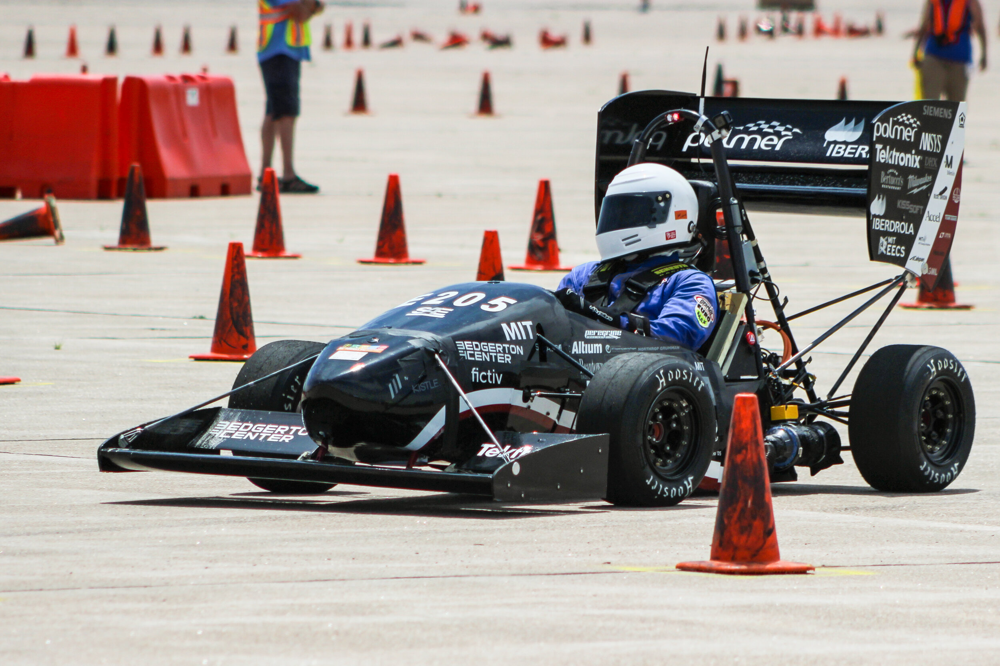
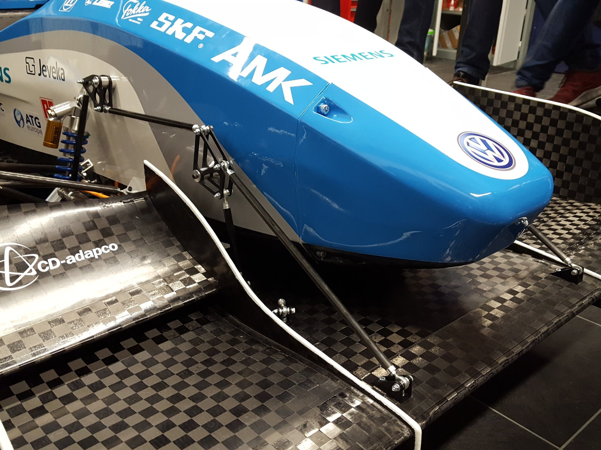
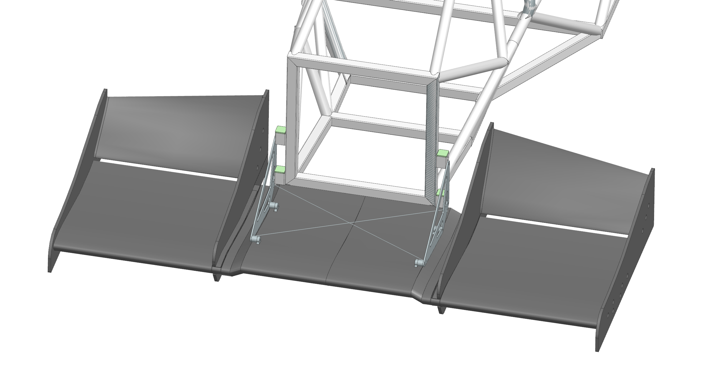
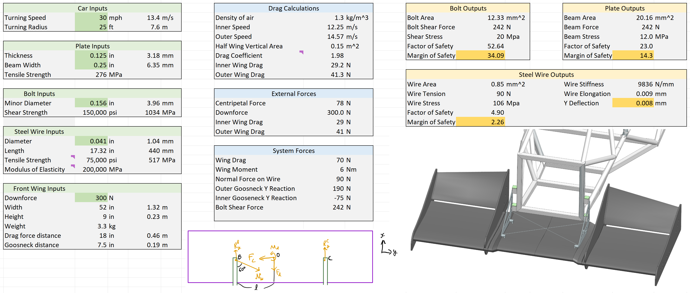
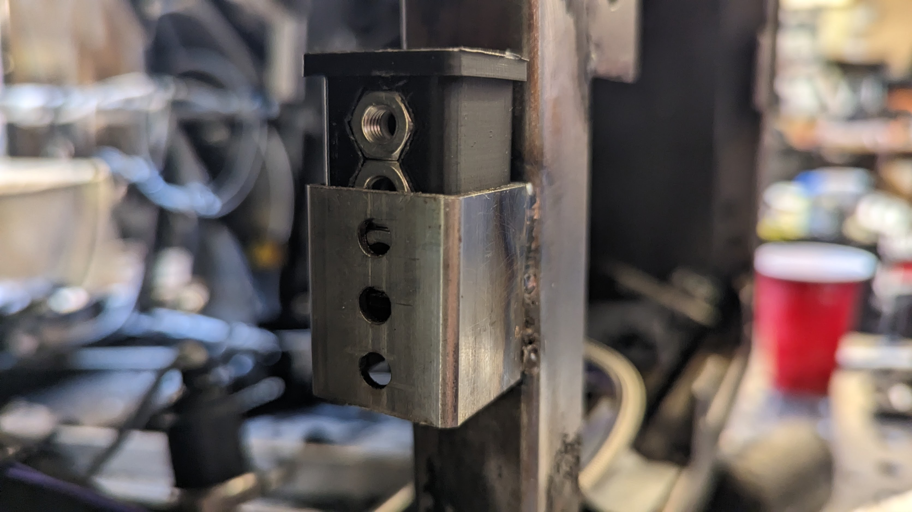
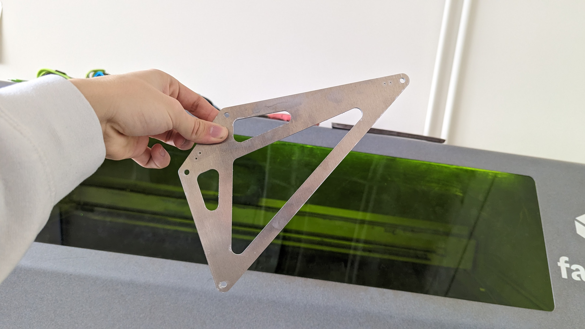
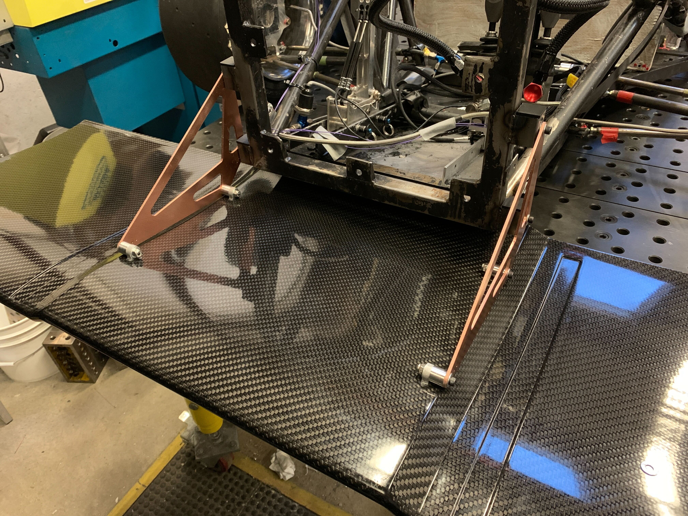

## Introduction
In my freshman spring, I designed and built the mounting for MIT Motorsports's front wing. 

A race car front wing is like a plane wing except it generates downforce instead of lift. This gives the car more traction so it can drive faster. The tradeoff between drag and downforce is discussed in more detail [here](https://www.designjudges.com/articles/adding-aero-justifying-aero). 

## Inspiration

I always start the design process by researching how my team and how teams better than us built similar mechanisms. I always want to build something meaningfully better than my team's previous designs.

Here's how MIT Motorsports has designed front wing mounting previously:

And here's how the best teams in the world do it:

Source: [Green Team](https://www.greenteam-stuttgart.de/fahrzeuge/e0711-12/) (University of Stuttgart)

Source: [Team Delft](https://twitter.com/FS_Team_Delft/status/738829087544905728/photo/1) (TU Delft)

Notice how Team Delft's front wing below is mounted to their suspension. This allows the front wing to dynamically stay off the ground as shown in [this video](https://www.facebook.com/watch/?v=10154465797501104).

## Design Reviews

I made the following slides for my design reviews, where I met with the captain, mech E lead, and aero lead to get feedback.

 - [DRDR](https://docs.google.com/presentation/d/1zAVIuWXT0yoEEV2e-_kg6EwNz4ZdgzA4/edit?usp=sharing&ouid=112501746677842811980&rtpof=true&sd=true) (Design Requirements)
 - [CoDR](https://docs.google.com/presentation/d/1aLd4BwhoxJx7IfLCQioF8A_P0ZD5Fsml/edit?usp=sharing&ouid=112501746677842811980&rtpof=true&sd=true)
 - [DR1](https://docs.google.com/presentation/d/1ViqaRXMAyD7Pd3QUtcSfwGA8dsO_qhwV/edit?usp=sharing&ouid=112501746677842811980&rtpof=true&sd=true)
 - [DR2](https://docs.google.com/presentation/d/1Uyvv6dRta7dwMrHwxp5dfZZ0g-9l5o94/edit?usp=sharing&ouid=112501746677842811980&rtpof=true&sd=true)

Unfortunately there wasn't time for a final DR before the front wing was manufactured, so the final design is different. The DRs above might be interesting to look at to see the design iterations, however.

After DR2 I learned that the carbon fiber layups on our nosecone were done inaccurately, so the front wing mounting would need significantly more clearance than I had designed for. In hindsight, I should have checked with the aero team at the beginning to confirm the critical dimensions rather than blindly trusting CAD. 

## Design Requirements
If the front wing touches the ground during a race, we'll be disqualified. The largest forces on the front wing will be while turning as tightly as possible as fast as possible. I conservatively decided to design for a worst-case scenario of making a 15 foot radius turn at 30 miles per hour.

It's also required by rules that the front wing mounting shears at 60 kilonewtons so that the impact attenuator can safely deccelerate the car if we crash. It's easily calculated that four 10-32 bolts will shear at this force.

## Design Choices

In previous years, we mounted the front wing using its vertical panels. But this requires the vertical panels to be structural. To save weight, we used light panels and added mounting holes to the front wing's aluminum ribs.

I also chose to use box tube and 3D printed inserts. In previous years, we machined dovetails that allowed the front wing to be taken on and off the car more easily. Dovetails are challenging to machine and only makes assembly marginally easier. Using box tube and 3D printed inserts with captured nuts still allows the front wing to be assembled without a wrench, but simplifies manufacturing significantly. Perhaps most importantly, the dovetail design would get caught on the nosecone as you tried to remove the front wing, making assembly extremely difficult.

I didn't want to have to set the car's ride height before welding the tubes on the car, so I included additional holes in the box tubes so the front wing can be moved up or down after the tubes are welded.

Thin aluminum plates are very strong for in-plane forces, but they bend easily when out-of-plane forces or moments are applied. When the car is turning at high velocity, most of the drag is on the outer side of the wing, creating a z-axis moment in addition to the centripetal forces on the front wing. Increasing the plate's thickness or changing its material adds a lot of weight, so instead I added tensioned steel wire to eliminate out-of-plane forces on the aluminum plates.

## Hand Calcs

I validated my design by calculating when the bolts will shear due to in-plane forces and how much the plates will deflect due to out-of-plane forces. My calculations showed that 10-32 bolts, 0.04" diameter steel wire, and a 0.125" thick aluminum plate would be enough. I made very conservative simplifying assumptions such as treating the aluminum plate as just one beam conecting the upper mounting bolts, which allowed me to lighten the plate significantly with cutouts. 

Here's the link to my [hand calcs](https://docs.google.com/spreadsheets/d/1rNC9b_zv_Xuq5mAN1VYvLebqXu5DN-nJ/edit?usp=sharing&ouid=109616792179121873495&rtpof=true&sd=true).

## Manufacturing
I used the 4-axis lasercutter in Morningside (the design makerspace above shop) to make the box tubes. Two of the tubes have cutouts to prevent intersection with one of the frame tubes.


We 3D printed the captured-nut insert and welded the tabs using a jig to ensure that the mounting holes were perfectly aligned on both sides of the car.

I lasercut the gooseneck because our waterjet was down.

We had to make custom length spacers on the lathe because of a design change made after the front wing had begun manufacturing. The cantilever isn't ideal but the diameter is large enough that the connection is still very stiff. Here is a photo of everything assembled except the safety wire.

## Conclusion

I used mechanics principles to design a lightweight but strong front wing mounting solution that is easy to remove from the car. Here are some things I learned:
 - Changing materials or increasing thickness is often an inefficient way to increase strength
 - Take advantage of geometry (tensioned wire, I beams, etc)
 - Check critical dimensions in real life (sometimes CAD isn't accurate enough)
 - Hand calcs allow you to design way better parts