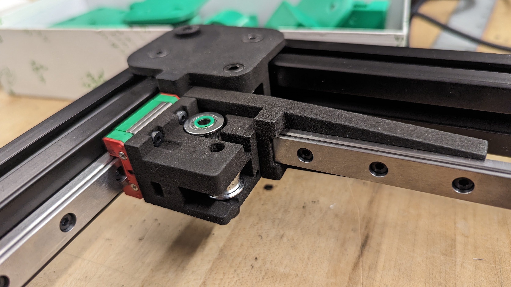
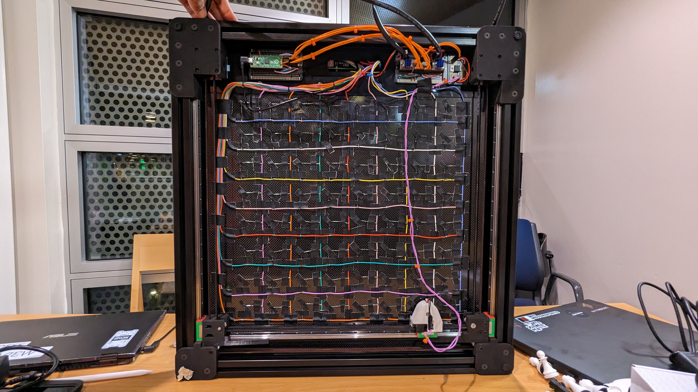

## Introduction

My friends Claudius, Eric, Gloria, and I built a robot named Magnets, or Mags for short. 

Mags can play chess. We put magnets inside every piece so that it can detect their positions using reed switches underneath the board. It moves the pieces using an electromagnet that can move to anywhere under the board. It decides what move to play using an open source chess engine called Stockfish. It's almost unbeatable.

We showed off the robot at the MIT xFair.


I managed to win a game against it with pure skill.



Here's a professionally produced video by Project Manus (one of our sponsors):


## Mechanical

You can view our CAD [here](https://cad.onshape.com/documents/2f3e28006e5b2cd6cd052bed/w/872351ec056974a435282c6c/e/d98ee53972011595aca895ee?renderMode=0&uiState=63c3c2efbb8ec706e89127de). 

Mags is kind of like a 3D printer. Instead of a hotend, we have an electromagnet. We designed the CoreXY gantry to be as thin as possible. When assembling the frame and gantry, we had to make everything perfectly square and parallel, or the linear rails would not slide smoothly. I described this process [here](https://kogappa.com/posts/mags_assembly).

The motors are fast!



We got our final parts printed for us by Formlabs on the Fuse 1. SLS Nylon is precise and stiff, which allowed us to make our gantry stiffer and straighter.

We waterjet the carbon fiber board:


The carbon fiber slightly delaminated around the holes unfortunately.

## Electrical

Our sensor array is wired like a keyboard. We used reed switches to detect the magnetic fields of the chess pieces. We use an input matrix to sample all 64 squares with just 16 pins. We wired it up by hand because we didn't have time to design a PCB. In hindsight we really should have designed a PCB.

Above is the wiring diagram for the board. It's exactly how high performance keyboards are wired. We set one column to high and see which rows get power, revealing the reed switches that are triggered in that column. Repeating this for all 8 columns gives us the positions of all of the pieces. Having diodes on each reed switch gives us [n-key rollover](https://en.wikipedia.org/wiki/Key_rollover).

The electromagnet is controlled with a power transistor and a flyback diode. The stepper motors are controlled by TMC2209 drivers, which are controlled by a RasPi Pico running a 3D printer firmware called [Klipper](https://www.klipper3d.org/). The reed switches are wired directly to the RasPi 4B, which handles the high level code.

## Code

You can look at our code [here](https://github.com/cttdev/mags). It's mostly written in python. We used the A* algorithm to find the shortest path to remove captured pieces from the board without collisions, as shown in the screenshot above. The RasPi was too slow, so we ended up doing all the compute on a laptop which updates the display and sends g-code to Klipper via websockets.

## Money
We got $500 of funding from [ProjX](https://projx.mit.edu) and $850 of funding from the MIT IAP Minigrant. Here's our [budget spreadsheet](https://docs.google.com/spreadsheets/d/1yqGCbEJ-lgLs7kG5b4U-4LM2qvh067T2bJkhiu7EdD8/edit?usp=sharing). 

## Conclusion
This project was really fun. I learned a lot of things, but most importantly I learned:
 - [Assembly is hard](https://kogappa.com/posts/mags_assembly) (if anything isn't assembled properly, the linear rails will bind)
 - Motivation is the bottleneck (most of our work was done as close as possible to the career fair demo)
 - Do what needs to be done first. Making this project work required focusing on the most urgent things, from manual labor to code.
 
Areas for improvement:
 - Reed switches suck. They have blindspots and are unreliable. We should have a 400x400mm PCB that has a ton of SMD hall-effect sensors on it instead.
 - We spent too much money. We could've built Mags for $500 if we needed to, but having such a large budget made us spend money on things we probably shouldn't have.
 - People have told me we should make Mags have an easier difficulty. But I'd rather make Mags a robot hustler. When you make a blunder, Mags should roast you. When it wins, Mags should arrange the pieces to form a big L on the board.