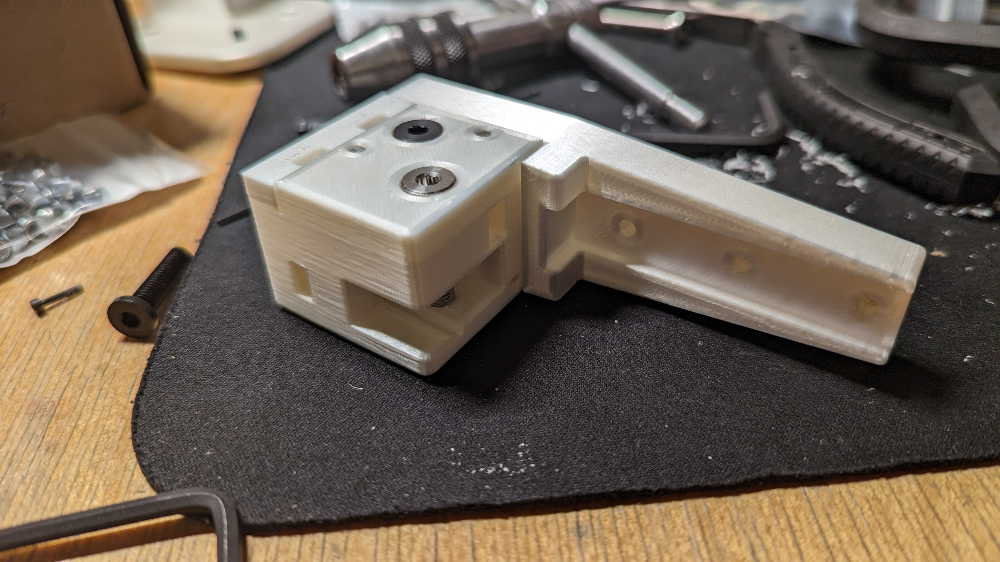
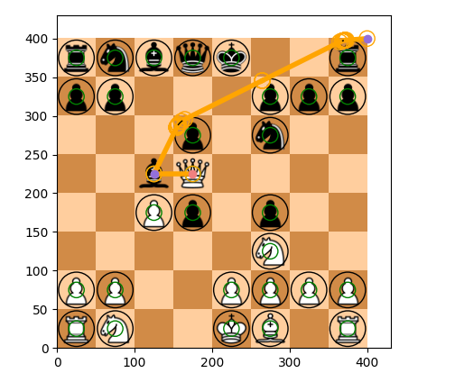

My friends Claudius, Eric, Gloria, and I are building a robot that could beat Magnus Carlsen in a game of chess. We're naming it Magnets, or Mags for short. 

We received (and spent) $1350 of funding from ProjX and the IAP Minigrant. Here's our [budget spreadsheet](https://docs.google.com/spreadsheets/d/1yqGCbEJ-lgLs7kG5b4U-4LM2qvh067T2bJkhiu7EdD8/edit?usp=sharing). 

This is our [CAD model](https://cad.onshape.com/documents/2f3e28006e5b2cd6cd052bed/w/872351ec056974a435282c6c/e/d98ee53972011595aca895ee?renderMode=0&uiState=63c3c2efbb8ec706e89127de). The pieces have embedded magnets so that Mags can move them with an electromagnet underneath the board. There are reed switches (which detect magnetic fields) underneath each square. Although reed switches cannot distinguish pieces from eachother, we know the starting position and can update it after every move. 

Mags has a CoreXY gantry similar to high performance 3D printers. Two stepper motors drive belts in tandem to control the position of the electromagnet. These belts can be tensioned at the carriage such that they straighten the x-axis. By using linear rails and 3D printed parts we were able to make the board just 40 mm thick.

We are beginning to assemble parts. This assembly of 3D printed parts connects the x-axis to the y-axis and holds two idler pulleys. 

We are also writing [code](https://github.com/cttdev/mags). This screenshot shows off our path planning. We used the A* algorithm to find the shortest path to remove captured pieces from the board without collisions.