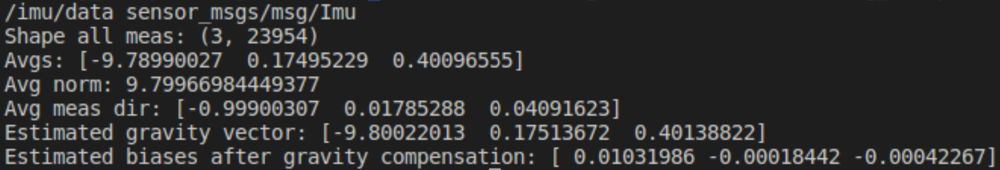

## Introduction

In my freshman fall, I did a UROP (undergraduate research) at the [Marine Robotics Group](https://marinerobotics.mit.edu/), a lab that is pushing the boundaries of navigation and mapping for autonomous robots. 

This post is meant to be a summary of my experience as well as documentation so that if you are working on something similar you can get a head start.

## Supervisor
My supervisor, [Alan Papalia](https://alanpapalia.github.io/), was the biggest reason I signed up for this UROP. I strongly believe that the best way to have a good UROP experience is finding a good mentor.

His [research](https://arxiv.org/abs/2302.11614) is super cool (tldr he uses math to improve [SLAM algorithms](https://en.wikipedia.org/wiki/Simultaneous_localization_and_mapping)) and he was the captain of [Illini Motorsports](https://motorsports.illinois.edu/our-cars-2/), the best internal combustion formula student team in the US. 

More importantly, he's an amazing person and mentor. When I began the UROP, he sent me a writeup of his undergrad research philosophy. I'll do my best to summarize the main points:

Blog posts he sent that I strongly recommend (especially the first one)
 - [Rose Wang’s Blog Post: Dear future undergraduate researcher](https://rosewang2008.github.io/blog/2021/01/03/undergrad-research-advice.html)
 - [Shashank Srikant’s Post: Aspiring Academics](https://shashank-srikant.github.io/notes/aspiring-academics/)
 - [Will Chrichton’s Post: Making the most out of CMU](https://willcrichton.net/notes/making-the-most-out-of-cmu/)

 It's important to make a serious commitment on both sides. The undergrad should be independent and spend 12+ hours a week and the mentor should support the undergrad and help them make progress.

 Peer-based interaction is important even if the undergrad knows way less than their supervisor. If the undergrad's ideas are always valued and respected, they can voice their opinions freely and there is a much more friendly and fun dynamic.

 These are the characteristics you should look for in a UROP supervisor. Find someone who is committed to mentorship and values your ideas. You should also leave enough room in your schedule to make a contribution to the lab so you don't waste your mentor's time.

 ## Project

IMUs are critical for marine robotics because there is no GPS signal at the bottom of the ocean. Unfortunately, IMUs experience drift. The goal of my project is to reduce IMU drift by collecting IMU data using a 6-axis robot arm and training a machine learning model.

## The Robot

The robot I used is called the UR3e. I named it Armin.


The first thing I had to do was bolt the robot down to a table, which required buying some really long bolts because of how the base is designed.

### Teach Pendant
The robot comes with a tablet called a "teach pendant" that you can control the robot manually with. It's super easy to learn - just go to program and create waypoints (the easiest way to do this is with the freedrive option) and you can make the robot go back and forth between the points you set.

I used the teach pendant to make the following video within half an hour of setting up the robot:



### Update Polyscope
First you have to update PolyScope (the pendant software) to 5.5.1. [Here's](https://www.universal-robots.com/articles/ur/documentation/legacy-download-center/) the universal robotics page on how to do that. Note the all caps and bolded text. 

### URCap
Next you will want to install a URCap. A URCap is a block you can put in your teach pendant program that will allow you to control the robot through the ROS driver. To connect the robot to the PC, it's easiest to use the ethernet port inside the control box. [Here's](https://github.com/UniversalRobots/Universal_Robots_ROS_Driver/blob/master/ur_robot_driver/doc/install_urcap_e_series.md) a guide on how to do that.

### Calibration
It's very important to get the robot calibration information so that the forward kinematics are accurate. Here is a [guide](https://github.com/UniversalRobots/Universal_Robots_ROS_Driver#extract-calibration-information) on how to do this. There is more calibration information in the [main driver page](https://github.com/UniversalRobots/Universal_Robots_ROS_Driver#extract-calibration-information).


## Linux

### Ubuntu
You'll want to install Ubuntu 18.04 on a laptop (preferably one with an ethernet port). It needs to be 18.04 because the [Universal Robots ROS Driver](https://github.com/UniversalRobots/Universal_Robots_ROS_Driver) is only stable for ROS Melodic, which requires Ubuntu 18.04. I tried ROS Noetic with Ubuntu 20.04 and it gave me problems so I wouldn't recommend it. Switching to ROS Melodic and Ubuntu 18.04 made my life much easier. I also tried using WSL but that made connecting to the robot and IMU hard so I switched to one of the lab's spare laptops.

### Real-time kernel
It's recommended to install a real-time kernel, but it was giving me trouble and isn't necessary so I skipped it. Here's a [guide](https://github.com/UniversalRobots/Universal_Robots_ROS_Driver/blob/master/ur_robot_driver/doc/real_time.md) on how to set up a real-time operating system.

## ROS

### Learning ROS
ROS is a publisher-subscriber-based framework for using a bunch of different packages together. I learned how to use it by following the [official ROS Tutorials](http://wiki.ros.org/ROS/Tutorials), but I'm not sure how much I can recommend this. Personally, the tutorials were quite dry and I think I could have learned what I needed to know on the fly much more easily.

### ROS Install
First, install ROS Melodic according to this [guide](http://wiki.ros.org/melodic/Installation/Ubuntu). Melodic is the only version that works with the universal robotics driver.

## IMU

I used the [Vectornav VN-100](https://www.vectornav.com/products/detail/vn-100) IMU. It's an old model but pretty nice as far as IMUs go. Research grade IMUs are on the order of $1000.

### Mechanical
I 3D printed an adapter to mount it to Armin.


For cable management, I used some velcro straps as shown below:



### ROS Driver

I used dawonn's [Vectornav ROS driver](https://github.com/dawonn/vectornav). Once you install it, you'll have to run the following line to allow the driver to access the USB port.
```
sudo chmod a+rw /dev/ttyUSB0
```
Then run 
```
roslaunch vectornav vectornav.launch
```
to get the IMU data.

### Orientation

The data from the vectornav is in the [IMU message](http://docs.ros.org/en/noetic/api/sensor_msgs/html/msg/Imu.html) format. Nicer IMUs integrate linear acceleration themselves and give you odometry messages as well, but the VN100 only gives you angular velocity and linear acceleration data.

I installed [imu_tools](http://wiki.ros.org/imu_tools?distro=melodic), a ROS package that applies some filters and fuses angular accelerations into an orientation.

You'll have to remap the IMU driver's topic to imu/data_raw for the imu_tools package to work. [Here's](https://roboticsbackend.com/ros-topic-remap-example/) a guide on how to do that. 

I used the following line (after running vectornav.launch) to get the orientation.
```
rosrun imu_filter_madgwick imu_filter_node --ros-args -p _use_mag:=false
```
Then
```
rosrun rviz rviz
```
allows you to visualize it. You'll want to install [rviz](http://wiki.ros.org/rviz) if you haven't already. By the way, I don't know how many times I was confused that rviz wasn't working and the reason was that I had typed "rvis" instead of "rviz." Visualize is not spelled "vizualize" so I feel like the Z was just thrown in by an edgy developer.


### Odometry

I used the [imu_to_odom package](https://github.com/nadiawangberg/imu_to_odom) to integrate linear accelerations. I had to install a bunch of obscure packages that ETH likes to use to get this to build.

I used the following line to run this package.
```
rosrun imu_to_odom imu_to_odom_node /uav/sensors/imu:=/imu/data
```
### Biases

IMU bias is the acceleration that the IMU sees when it is not moving. Since accelerations are integrated twice to get position, this noise adds up extremely quickly and can totally throw off odometry. To remove bias, I recorded two minutes of imu data when it was not moving and calculated the average bias.

The following line creates a rosbag with two minutes of IMU data.

```
rosbag record --duration=120 --output-name=bias.bag /imu/data
```

I did this with both the robot on and the robot off to see if there was a significant difference.
Here's the data with the robot off:

and the robot on:


I concluded that the difference in biases were marginal.


## MoveIt

MoveIt is the software that plans out the arm's movements. This is way harder than it looks because 6-axis arms have joint positions called [singularities](https://robohub.org/3-types-of-robot-singularities-and-how-to-avoid-them/) where the robot would have to move at infinite speed to move a small distance in certain directions. That's why you'll sometimes see really complicated arm trajectories - the planner is avoiding these singularities.

### UR3E Config
First, I followed MoveIt's [setup assistant tutorial](http://docs.ros.org/en/melodic/api/moveit_tutorials/html/doc/setup_assistant/setup_assistant_tutorial.html) to create a UR3E config first.

If you've done everything right, running the following command should give you the message "Connected to robot and ready to receive move commands".
```
roslaunch ur3e_moveit_config move_group.launch
```

### RViz

The next step is to follow MoveIt's [RViz tutorial](http://docs.ros.org/en/melodic/api/moveit_tutorials/html/doc/quickstart_in_rviz/quickstart_in_rviz_tutorial.html). They use the Panda robot but you'll want to use the robot config you created in the previous section.

The following line launches the move group, which calculates trajectories for us.
```
roslaunch ur3e_moveit_config move_group.launch
```
The next line launches rviz with the UR3E MoveIt config.
```
roslaunch ur3e_moveit_config moveit_rviz.launch rviz_config:=$(rospack find ur3e_moveit_config)/launch/moveit.rviz
```

Using Rviz and MoveIt, you can make the robot move to any orientation you want.



### Python Scripts

The next step is to get the robot to follow arbitrary trajectories. This will require making python scripts.

MoveIt has an [excellent tutorial](http://docs.ros.org/en/melodic/api/moveit_tutorials/html/doc/move_group_python_interface/move_group_python_interface_tutorial.html) on how to do this.

You can build all kinds of trajectories, but watch out for singularities as they will get in the way of seemingly simple trajectories. Unfortunately, despite having 6 axes, a robot arm cannot always move in a straight line while maintaining tool orientation. Here's a spiral trajectory I made.

```
waypoints = []
r = 0.25
wpose = geometry_msgs.msg.Pose()
wpose.position.z = 0.3

for theta in range(360):
    wpose.position.x = r*math.cos(pi/180*theta)
    wpose.position.y = r*math.sin(pi/180*theta)
    wpose.position.z += 0.0005
    wpose.orientation.w = 1.0
    waypoints.append(copy.deepcopy(wpose))

plan, fraction = armin.move_group.compute_cartesian_path(waypoints, 0.01, 5.0)

armin.move_group.plan()

print("Press ENTER to execute the circular path")
raw_input()
armin.move_group.execute(plan, wait=True)
armin.move_group.stop()
armin.move_group.clear_pose_targets()
```

Here's the video of that trajectory (it includes some other simple waypoint trajectories that aren't included in the above code).




## Conclusion

My experience doing research at the Marine Robotics Group was fantastic. I owe this entirely to Alan, who was an incredible mentor. I would not have made the time to write this blog post if not for how well he treated me.

If you are considering undergraduate research, make sure to take a lighter courseload, especially if you do time consuming extracurriculars like FSAE. In fact, if you are doing a student build team, I would recommend saving research for a summer internship (or IAP if you're at MIT) because it was really hard for me to make a solid contribution to racecar and research at the same time. 

If you take anything at all away from this blog post, read [Rose Wang's undergrad research advice](https://rosewang2008.github.io/blog/2021/01/03/undergrad-research-advice.html) and remember this:

> Find a good project by finding a good supervisor.