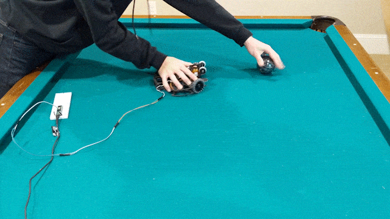

## Introduction
In high school, I competed in RoboCupJunior Soccer. My friends and I started Team Orion in 8th grade, and since then we have been national champion 3 times. In 2021, we represented the United States at the virtual RoboCup2021 Worldwide competition with the robot pictured below. We won the Best Video award.

Here is our promo video we made to thank our sponsors:



Team Orion has four members and no mentors. As the team's mechanical engineer, I designed, manufactured, and assembled all the mechanical parts of the robot, but I did not make the motors, PCBs, or solenoids. 

## Dribbler
We were the only lightweight division team at the world cup to have a dribbler and kicker. The dribbler gives the ball backspin so the robot can keep control of it while maneuvering.

Spring suspension allows the dribbler to absorb impacts.

The dribbler enables cool (but impractical) curve shots.

## Kicker
The robot is equipped with a solenoid kicker powered by a capacitor that releases 80V of stored energy.

## Omniwheels
I redesigned my omniwheels to save weight for the dribbler. After multiple iterations, I reduced the weight to just 12 grams. 

The wheels also feature two layers of silicone tube rollers for traction and a compact set screw clamping design.

## 3D Printing
I printed most parts in carbon-fiber reinforced nylon, which is 30% less dense and much more impact resistant than PLA. I upgraded my CR10 3D printer extensively (E3D V6 all-metal hotend, SKRV1.4 motherboard, TMC2209 stepper drivers, Zesty Sidewinder remote direct drive, dual lead screws, filament dry box) to make higher quality parts.

## CAD
[Link](https://cad.onshape.com/documents/3d5efefe4047dcd9d6910649/w/6fe323fdc0b05086fecb60ba/e/13b73def6a4212ae61e4a6c4?renderMode=0&uiState=63424617ba73f7146a152100) to my Onshape CAD model.

## More info
For more information about our robot, see our [technical paper](https://robocupjuniortc.github.io/soccer-2021/pdfs/TDPs/LWL_Orion.pdf) or our 2021 video submission:


