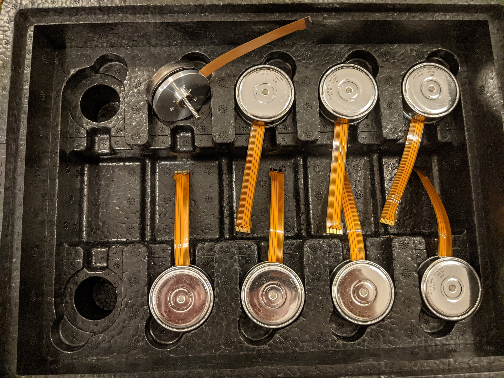
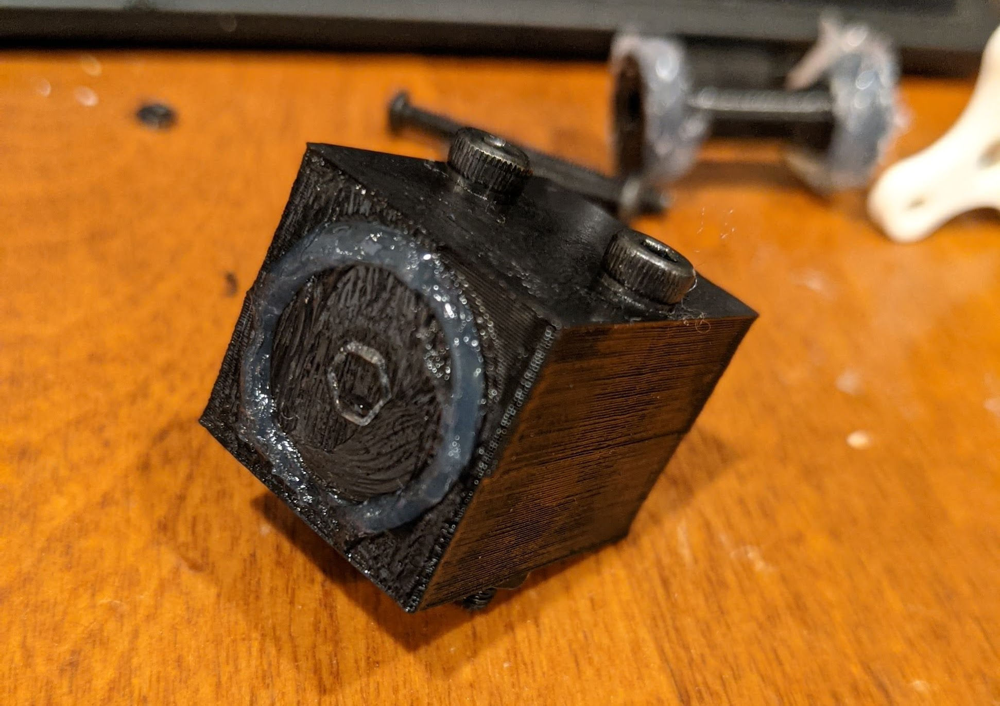
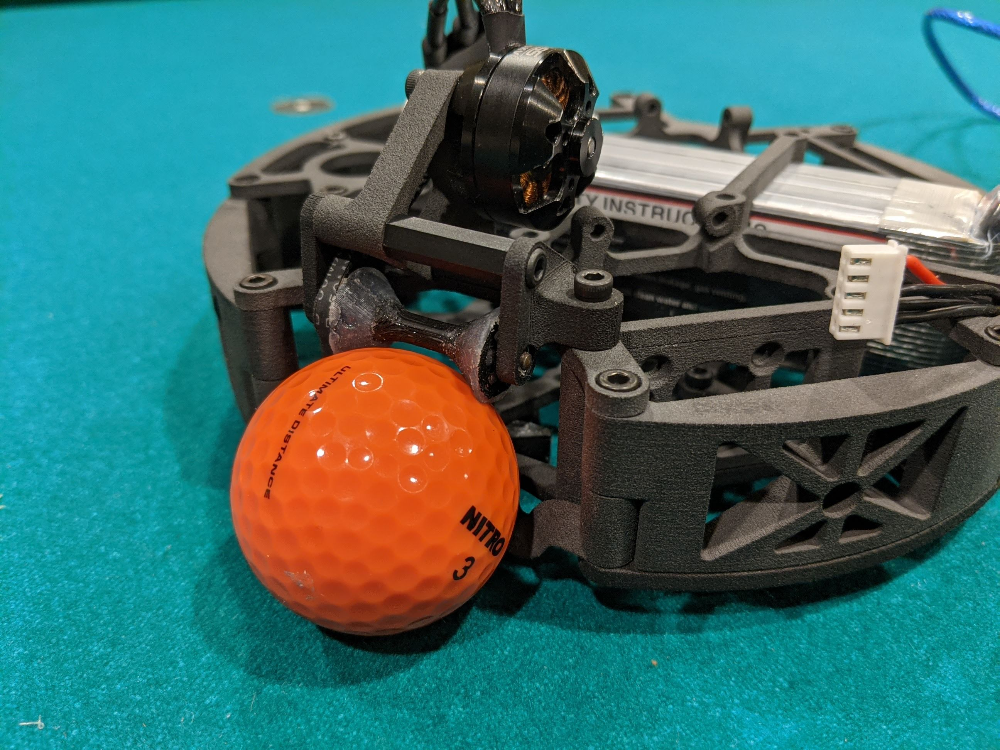

## Introduction

After four years of competing in RoboCupJunior Lightweight (read about [our lightweight robot](https://kogappa.com/projects/rcj_lw/)), Team Orion switched to the Open league. In 2022, we represented the United States at the RoboCup2022 in Bangkok. Our [poster](https://drive.google.com/file/d/1emEfwXLS5n6g16z6DUGnz8gLUFfxLsoF/view?usp=sharing) won the Best Poster award.

## Rule Changes
The important rule changes in the Open league are:
 - 2200g weight limit (lightweight is 1100g)
 - 18cm diameter limit (lightweight is 22cm)
 - Golf ball (lightweight is a larger, IR-emitting ball)

## Design Changes
Since I was the team's mechanical engineer, the biggest changes to the mechanical design are:
 - Moving from brushed motors with commmercial gearboxes to brushless pancake motors with a custom gearbox
 - Exterior line sensor PCB
 - Packaging everything inside 18cm diameter while maintaining low center of mass
 - Adding a second dribbler in the back for potential ball-hiding strategies
 - 4S 2600mAh lipo (previously 3S 1400mAh)

## CAD

I designed our [robot](https://cad.onshape.com/documents/d3a0178b0f6c32667a12811f/w/e578c707c8a94966e4159e1e/e/2745129e1c60ff319e287fe6?renderMode=0&uiState=6339b5cef4b4937263754cd9) in Onshape

## Scoring
Like our lightweight robot, our open robot scores using a solenoid kicker and omnidirectional movement.

## Motors
Inspired by [Major League teams](https://www.youtube.com/watch?v=yaFfWd6ZHGA) (college-level), we used Maxon's 30W EC45 Flat brushless motors. These motors are very powerful and have a small footprint. Maxon generously sponsored us through their [Young Engineer's Program](https://drive.tech/en/young-engineers-program). Due to limitations of our motor drivers, we could only use a fraction of their power. In hindsight, we should have bought Maxon's 4-Q ESCON motor drivers instead of trying to design our own.

## Omniwheels
I redesigned the omniwheels to have a 4.5:1 gear reduction. Major league teams typically buy steel internal gears and machine them to fit their wheels, but these gears cost $60 each and I don't have access to precision manufacturing. Even worse, steel gears are heavy and difficult to package compactly. 

I designed custom aluminum gear which were manufactured via wire EDM instead. Sonic EDM generously manufactured our gears for free. These gears are lightweight, but the custom gear profile makes them strong. We manufactured the motor shafts to a D shape so that we didn't need set screws for the pinion.

## Line Detection
Robots that go outside of the white lines on the field are removed from play. In previous years, we have had a ring of line sensors to detect the line. In 2022, I made the line PCB go around the perimeter of the robot so that we would see the line as soon as possible. This allows our robots to reach outside of the line while keeping a part of our robot inside bounds. 

We determine the orientation of the line by adding the vectors of the triggered line sensors that are furthest apart, and use vector projections to stay within bounds. For details, see our [2021 technical paper](https://robocupjuniortc.github.io/soccer-2021/pdfs/TDPs/LWL_Orion.pdf).

## Dribblers
Our robot has two identical dribblers. For simplicity, I did not include spring suspension in this dribbler design. I experimented with molding silicone sealant for the rollers. Silicone sealant doesn't adhere to soapy water, so I sandwiched the roller between soap-covered negatives. Rollers molded this way were extremely grippy, but extensive iteration and testing demonstrated that silicone sealant was not durable enough. I switched to silicone tube which was much stronger.

## 3D Printing
Although I used my 3D printer for prototyping, most of the final parts were 3D printed on a Formlabs Fuse 1. Formlabs generously gave me access to their Selective Laser Sintering (SLS) 3D printers, which can make complicated, isotropic nylon parts.

SLS 3D printers create parts by using lasers to selectively solidify powder one layer at a time. The layers of powder act as support. Formlabs's slicer, Preform, automatically packed 3 robots worth of parts into a single print.

After my print job finished, a "cake" of powder was produced. I excavated parts out of this cake and cleaned them using a specialized tumbler. 

## More info
For more information about our robot, see [our poster](https://drive.google.com/file/d/1emEfwXLS5n6g16z6DUGnz8gLUFfxLsoF/view?usp=sharing).