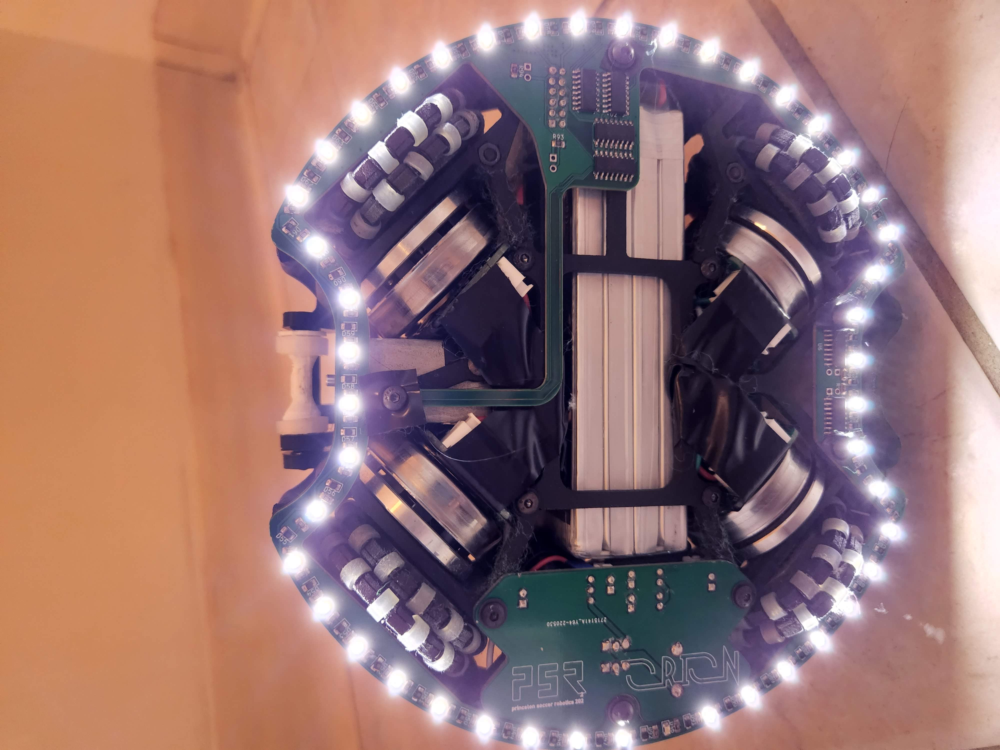

This robot plays soccer autonomously. Our team was national champion in the Open division and represented the United States at the RoboCup2022 in Bangkok. 

I designed our [robot CAD](https://cad.onshape.com/documents/d3a0178b0f6c32667a12811f/w/e578c707c8a94966e4159e1e/e/2745129e1c60ff319e287fe6?renderMode=0&uiState=6339b5cef4b4937263754cd9) model in Onshape

[My poster](https://drive.google.com/file/d/1emEfwXLS5n6g16z6DUGnz8gLUFfxLsoF/view?usp=sharing) won Best Poster award at Bangkok.

