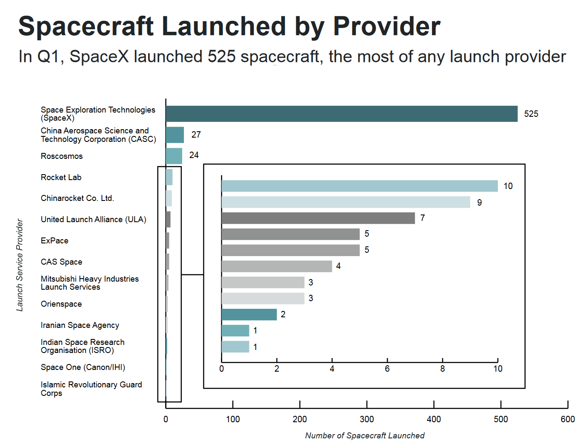
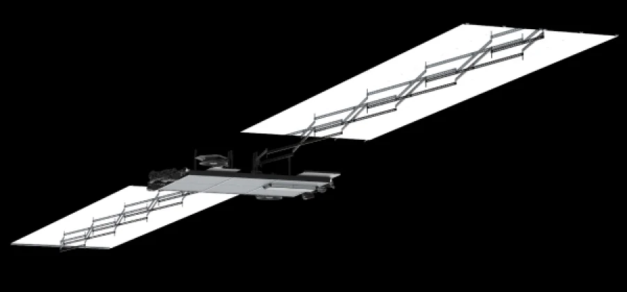

Last summer, I had the opportunity to intern at SpaceX, which is in my opinion the coolest company in the world. I worked on a Starshield team, which does government and defense satellites, so I can't talk about any specifics of my internship. So instead I'd like to focus on why SpaceX is such an incredible company and what I learned from this internship.

# Starlink

There are currently almost 7,000 starlink satellites in orbit. Look at them here: https://satellitemap.space/?constellation=starlink#

These are the summary of global orbital space launches in Q1 of 2024, as [reported](https://brycetech.com/reports/report-documents/Bryce_Briefing_2024_Q1.pdf) by Bryce Tech. In 14 weeks, SpaceX had 31 launches and put 525 spacecraft into orbit.  This is more than an order of magnitude higher than China and Russia's space programs put together! It's hard to grasp how dominant SpaceX is.

That's more than two rocket launches and 40 satellites per week! How can you manufacture 40 satellites (each costing millions of dollars) and 2 rockets ($70 million per launch) every week, where the slightest quality control defect can result in complete mission failure? 

SpaceX had their [first mission failure](https://www.space.com/spacex-finds-cause-falcon-9-rocket-failure) since June 2015 in July 11, 2024. The engineering rigor needed to see these levels of reliability and performance is simply absurd.

### V2 Mini

The satellites have been designed to stack tightly to pack a ton of satellites in a rocket, while deploying their two massive dual axis solar arrays and electronics on orbit. The satellites are extremely lightweight and compact as a result.

### Direct-to-Cell

## Phased Arrays

SpaceX provides internet to users through *phased arrays*. These are PCBs with evenly spaced antennae elements that are fired in a precise sequence to generate a RF beam that can be steered with mind-breaking precision. This allows a satellite the size of a car orbiting at 18,000 mph trying to communicate with a laptop-sized PCB mounted to someone's roof or a boat in the middle of the Pacific. Here are some cool visuals of phased arrays from [wikipedia](https://en.wikipedia.org/wiki/Phased_array):

<iframe width="560" height="315" src="https://upload.wikimedia.org/wikipedia/commons/transcoded/8/80/Phase_array_sweep.webm/Phase_array_sweep.webm.480p.vp9.webm
" frameborder="0" allowfullscreen></iframe>

## Deploy Footage

This looks like something out of a science fiction movie. 

<blockquote class="twitter-tweet" data-media-max-width="1920">
Video of last night’s <a href="https://twitter.com/Starlink?ref_src=twsrc%5Etfw">@Starlink</a> satellite deployment <a href="https://t.co/K7ezZLLusz">pic.twitter.com/K7ezZLLusz</a>
&mdash; SpaceX (@SpaceX) <a href="https://twitter.com/SpaceX/status/1703132464712237216?ref_src=twsrc%5Etfw">September 16, 2023</a></blockquote> 

<blockquote class="twitter-tweet" data-media-max-width="1920">
First Starlink v2 satellites reach orbit <a href="https://t.co/0l08568mJ9">pic.twitter.com/0l08568mJ9</a>
&mdash; Elon Musk (@elonmusk) <a href="https://twitter.com/elonmusk/status/1630394434847227909?ref_src=twsrc%5Etfw">February 28, 2023</a></blockquote> 

