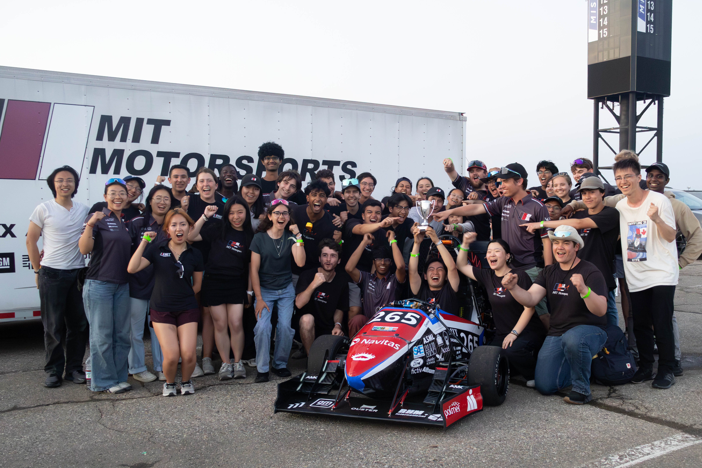

I was responsible for designing and building the suspension for the MIT Motorsports MY26 racecar. I had a ton of fun learning about vehicle dynamics and approaching a very different kind of engineering problem than I had faced before. Placing suspension points even a few millimeters in the wrong direction could make your car undrivable, and tuning the springs, damper settings, and kinematics to be optimal can make a car 30% faster without any change in mass, power, or appearance.

I'll eventually write up a post walking through the design process, but for now here's a video of the roll-heave decoupled suspension in action. 



MY25 was the first MIT car in 6 years to finish endurance, the final 22 km race of the Formula SAE competition, and we placed [9th](https://www.fsaeonline.com/CompResources/2025/8f030a58-d9e4-49b8-bc83-6ca16c7ce715/FSAE_2025_MI6_results.pdf), a big improvement from 24th in [2024](https://legacy.sae.org/binaries//content/assets/cm/content/attend/student-events/results/formula-sae/fsae_ev_2024_results.pdf) and [43rd](https://legacy.sae.org/binaries//content/assets/cm/content/attend/student-events/results/formula-sae/fsae_ev_2023_results.pdf) in 2023 when I joined the team after it had been unable to compete for several years.

Thanks to everyone who poured their blood sweat and tears into this dream.
Because racecar.