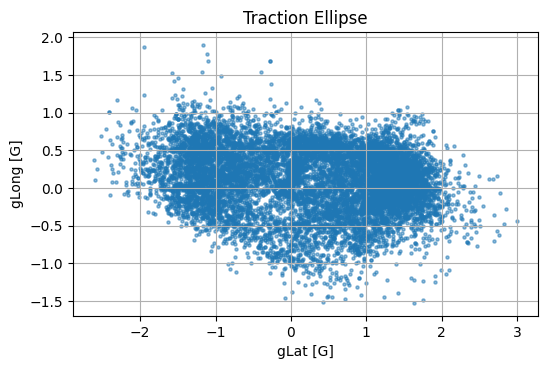

I was responsible for designing and building the suspension for the MIT Motorsports MY26 racecar. I had a ton of fun learning about vehicle dynamics and approaching a very different kind of engineering problem than I had faced before. Placing suspension points even a few millimeters in the wrong direction could make your car undrivable, and tuning the springs, damper settings, and kinematics to be optimal can make a car 30% faster without any change in mass, power, or appearance.

I'll eventually write up a post walking through the design process, but for now here's a video of the roll-heave decoupled suspension in action. 

Here's my [design binder](https://docs.google.com/presentation/d/1r4l6y_kzt-nzqE6rOpP7Vkd_PCaPyI831_t2-cMHer0/edit?usp=sharing) which gives a technical overview of the suspension design.



The suspension performed well, reaching 2.2 lateral G’s of acceleration while cornering, 1.2 G's of longitudinal acceleration, and -1.5 G’s braking. The data was collected using a [Sensoric OMS Race](https://www.sensoric-solutions.com/products/sensors/oms-race-biaxial-sensor-for-motorsport/) optical and inertial sensor. 

Feedback from our Vehicle Performance lead and driver, [Vincent Xiao](https://www.linkedin.com/in/vincentx22/):
> i think yeah as a whole my25 solved most of the issues with corner entry responsiveness and initial turn in grip that plagued my24, and the kinematics allowed for much stronger and aggressive braking that i don't think we were able to replicate in my26 even (perhaps a sacrifice that came along with more aggressive camber gain). the move to decoupled finally allowed us to run the correct ride and roll rates, and the additional roll damping made it really easy to both diagnose and tune our entry and exit stability and control. the main limitations were tire utilization, putting too much energy into the front axle which led to overheating of the surfaces, and not enough work being put into the front inside tire which further compounded the temperature issue and the lack of front end after the apex

MY25 was the first MIT car in 6 years to finish endurance, the final 22 km race of the Formula SAE competition, and we placed [9th](https://www.fsaeonline.com/CompResources/2025/8f030a58-d9e4-49b8-bc83-6ca16c7ce715/FSAE_2025_MI6_results.pdf), a big improvement from 24th in [2024](https://legacy.sae.org/binaries//content/assets/cm/content/attend/student-events/results/formula-sae/fsae_ev_2024_results.pdf) and [43rd](https://legacy.sae.org/binaries//content/assets/cm/content/attend/student-events/results/formula-sae/fsae_ev_2023_results.pdf) in 2023 when I joined the team after it had been unable to compete for several years.

Thanks to everyone who poured their blood sweat and tears into this dream.
Because racecar.