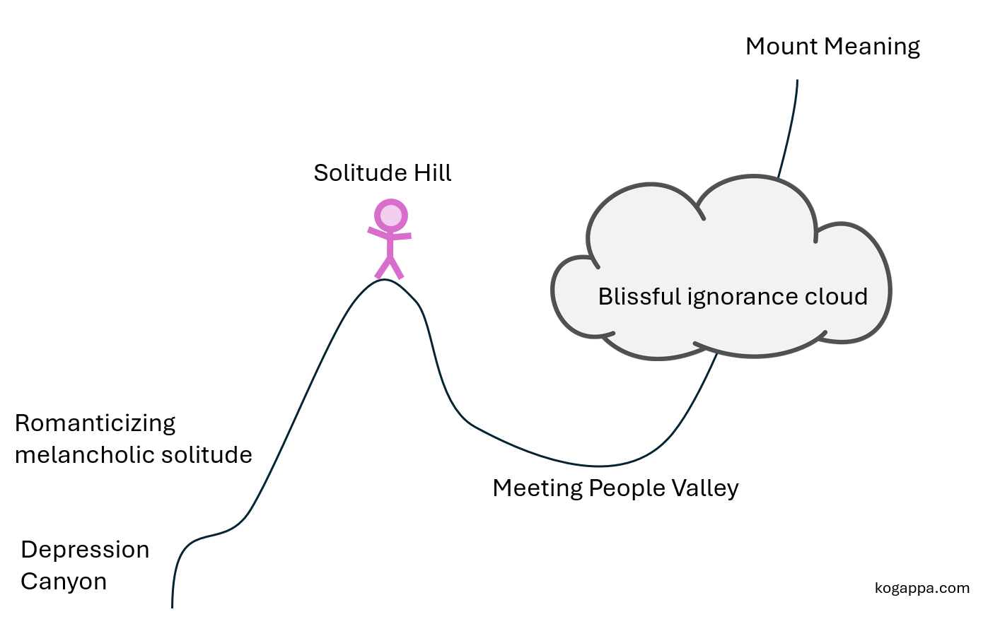
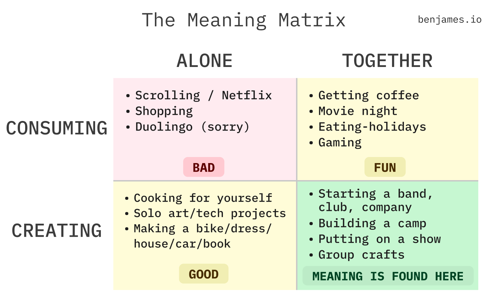
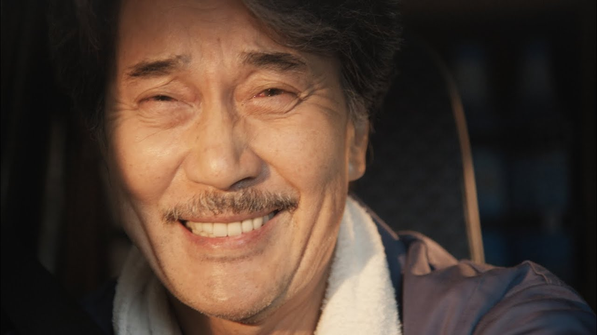
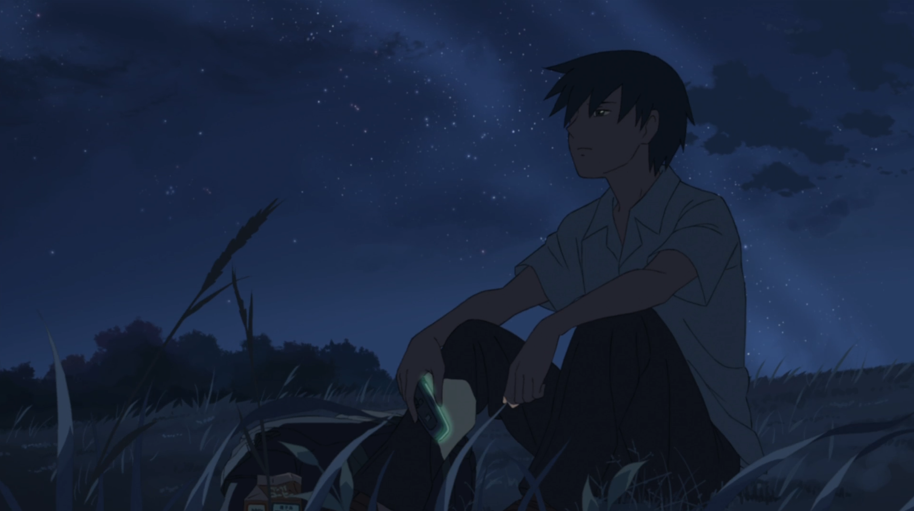
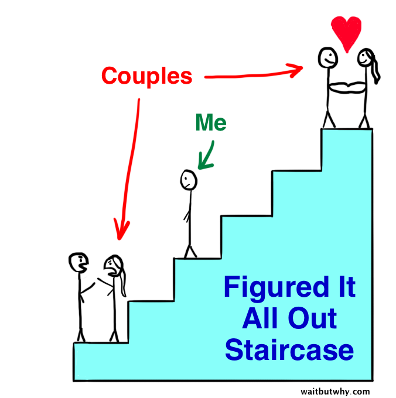
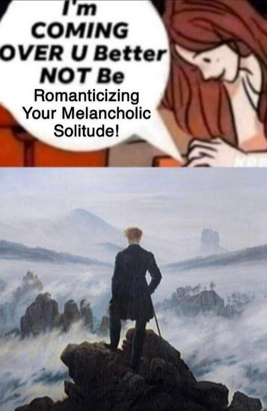

This is currently a draft, I'd very much appreciate feedback [anonymously](https://www.admonymous.co/keiji), through discord (`kogappa`), or via email (keijii@mit.edu)!

*****

It's annoying that loneliness is optional. In high school, I always ate lunch by myself and went through my day without talking to anybody. This was the least lonely period of my life. For me, loneliness comes from the *longing* for connection, not the quantity of it. I now have lots of friends both in-person and oceans away, yet the pang of loneliness strikes on weekends when I don't know what to do with myself.

This is a stupid problem. Why don't I just fix my attitude and be grateful for the friends and family that I have and enjoy spending time alone?

It's actually my appreciation of both friendship and solitude that is responsible for my loneliness. I've experienced being both too lonely and not lonely enough. But to unpack this I'll have to ramble a bit about my life story (I promise it'll be more concise than how I tell it in-person).

In high school I decided not to be lonely—I didn't need new in-person friends because even after I moved my middle school friends wanted to stay in touch. I was so grateful that they would go out of their way to call me and even come visit sometimes. We would imagine sci-fi worlds together and roleplay inside them with strategy games with rules we made up ourselves. We played the best video games. We talked about our biggest dreams and fears.

Meanwhile, every high school lunch table I sat at felt like a gathering of convenience friends where spending time together was for Instagram or Clash Royale when it should be the other way around. I found that I vastly preferred spending time alone than with people at my high school. My hometown friends were special, and there was no point in trying to "find my people" a second time, considering that I was going to go to college in a few years anyway. Convenience friends were tiring—I might as well enjoy solitude instead. I went on runs, played chess, practiced piano and saxophone, studied math, meditated, read books, and gained a greater appreciation for nature and the world.[^1] I spent a lot of time thinking for myself, and listened to jazz, classical, and electronic music without lyrics.[^2]

But when I graduated high school, I realized that my best memories were not when I was alone. They were with friends and family, and the main reason I didn't have more of them was that all my close friends lived a six-hour train ride away. Despite keeping in touch at a level that rivals some long-distance relationships, my hometown friends had way more of these memories without me simply as a result of spending 10x more time together. As much as I enjoyed spending time alone, the lifelong memories and friendships were all made in-person. Looking back, those in-person experiences are the things most worth remembering.[^3] 

For four years I had bamboozled myself into a local maximum of blissful ignorance:

I felt I had squandered the opportunity to make friends with people from my high school. In hindsight there were amazing people there who would have wanted to be close friends with me had I not given up on making new friends so quickly.[^4] It felt even more existential than that. If I didn't meet new people, how do I expect to ever meet a life partner and eventually have a family? I'm pretty sure [having a family](https://paulgraham.com/kids.html) would be an enormous part of my happiness, fulfillment, and contribution to the world, and certainly I could be substantially happier[^5] if I wasn't single.[^6]

I decided that in college I was going to stop being a loner. I was going to make great lifelong friends.

I joined [MIT Motorsports](https://www.youtube.com/watch?v=xGB0z81MeCg&t=1s) where my friends and I poured our (literal) blood, sweat and tears into building three electric racecars. I've found that mutual suffering towards a creating something meaningful together is a fantastic way to make friends. In [Aliveness and where to find it](https://benbyfax.substack.com/p/aliveness), Ben James writes that creating things together, is where the greatest memories are made.[^7]

[Creating together](https://kogappa.com/projects/mags/) doesn't happen by default because society has evolved towards convenience and consumption. It requires effort, social risk, and inconvenience, but this is part of the necessary struggle to traverse the Meeting People Valley and get to Mount Meaning.

But I found myself wanting more. I didn't just want people to make things with, I wanted friends who really [listen](https://kogappa.com/rants/listening/). This kind of friendship doesn't happen overnight; it requires emotional bandwidth and connection at a personal level. 

This loneliness became existential and crippling, and I struggled with depression for a year. The sadness and negativity was addictive. This is a evil form of loneliness that grows on self-hatred and self-pity. I was romanticizing my melancholic solitude.[^8] Eventually through therapy and reflection I was able to escape the vicious cycle and developed a healthy attitude towards my loneliness. Listening to better music helped.[^9]

It took me multiple years of evolving friend groups before I found people who I really felt I could have truly satisfying late night honest and vulnerable conversations with.

As I got older, I started to realize that making really good friends was becoming increasingly about nature more than nurture. People change less as they get older. My hometown friends and I grew up together and so we shared the same interests, attitudes toward friendship and trust, and general life values. But with people I meet in my 20s, it's much less likely that they happen to have the same friendship compatibility and chemistry, and they are unlikely to change substantially as am I. 

That means it's not enough to be a good friend, to climb Mount Meaning I also need to be effective at *finding my people*. This is really hard and the best I've come up with is simply going to boring parties and events, getting people's contacts, getting to know them 1:1, and eventually getting introduced to their friend groups.[^10] But despite having tried hard meeting people over the years, I still get much more enjoyment and human connection through remotely spending time with my hometown friends from an ocean away than anyone else I've met since. The weekends when we visit each other are still 10x more fun and memorable than the weekends without them. But I have faith that if I keep working at it, meeting new people with an open mind, I will get to Mount Meaning eventually.

Some amount of loneliness is healthy. Pain isn't always bad—running, writing, work, and many other things which hurt are good for us. Being a loner is easy for introverts like me. It's more fun to spend time on my own than to meet people. But if you eventually want to see the fruits of great memories with friends and family, you must traverse Meeting People Valley before you can climb Mount Meaning. It's okay to be lonely, but it's up to you to turn that loneliness into something meaningful.

[^1]: This song describes the feeling of enjoying time alone well: <iframe data-testid="embed-iframe" style="border-radius:12px" src="https://open.spotify.com/embed/track/1GIsnE71uUtWvGpvnJCTXO?utm_source=generator&theme=0" width="100%" height="152" frameBorder="0" allowfullscreen="" allow="autoplay; clipboard-write; encrypted-media; fullscreen; picture-in-picture" loading="lazy"></iframe>

[^2]: I would listen to songs without lyrics like the ones below which I felt these gave me more mental space to have my own attitude towards my feelings than songs with lyrics infected with societal propaganda of love and sadness. <iframe data-testid="embed-iframe" style="border-radius:12px" src="https://open.spotify.com/embed/track/6fbVEr7GDlQJybegYNivik?utm_source=generator&theme=0" width="100%" height="152" frameBorder="0" allowfullscreen="" allow="autoplay; clipboard-write; encrypted-media; fullscreen; picture-in-picture" loading="lazy"></iframe><iframe data-testid="embed-iframe" style="border-radius:12px" src="https://open.spotify.com/embed/track/1UjcfBPJt8mMvJ5QyfaWuq?utm_source=generator&theme=0" width="100%" height="152" frameBorder="0" allowfullscreen="" allow="autoplay; clipboard-write; encrypted-media; fullscreen; picture-in-picture" loading="lazy"></iframe> <iframe data-testid="embed-iframe" style="border-radius:12px" src="https://open.spotify.com/embed/track/5JnwztFkWdoHrSGzIgh3bN?utm_source=generator&theme=0" width="100%" height="152" frameBorder="0" allowfullscreen="" allow="autoplay; clipboard-write; encrypted-media; fullscreen; picture-in-picture" loading="lazy"></iframe>

[^3]: One of my favorite movies is called *[Perfect Days](https://www.youtube.com/watch?v=QzZBbX5A1FA)*, and it's about a middle-aged Tokyo toilet cleaner who lives alone. He takes pride in doing his work well and he appreciates nature and books. I think he views himself like the trees which he photographs in the parks: contributing to society in a small, beautiful, and peaceful way. One interpretation is that the movie is about the value of enjoying the little things and living life simply. The dialogue and plot is sparse so it's up to the viewer, but I think the story is actually about the man experiencing a lifetime's worth of loneliness and regret after his niece spends some time with him and he realizes how much of life he was missing out on by spending it all alone. 

[^4]: Another of my favorite movies is *[5 Centimeters Per Second](https://www.youtube.com/watch?v=iPsu_sk-e7Q)*, where the main character moves away from his close friend and trying to keep in touch with her gets in the way of connection and fulfillment. I think my life mirrors Takaki's in many ways, minus the romance haha 
[^5]: Wait but why has an excellent [blog post](https://waitbutwhy.com/2014/02/pick-life-partner.html) on this:

[^6]: Songs I like which tell this story through their lyrics: <iframe data-testid="embed-iframe" style="border-radius:12px" src="https://open.spotify.com/embed/track/0DBF9dFpekB4AMCYiR2SSY?utm_source=generator&theme=0" width="100%" height="152" frameBorder="0" allowfullscreen="" allow="autoplay; clipboard-write; encrypted-media; fullscreen; picture-in-picture" loading="lazy"></iframe> <iframe data-testid="embed-iframe" style="border-radius:12px" src="https://open.spotify.com/embed/track/7JIuqL4ZqkpfGKQhYlrirs?utm_source=generator&theme=0" width="100%" height="152" frameBorder="0" allowfullscreen="" allow="autoplay; clipboard-write; encrypted-media; fullscreen; picture-in-picture" loading="lazy"></iframe>

[^7]: He's a very cool guy and I recommend reading his [blog](https://www.benjames.io/). I helped him set up a [dessert contest](https://benbyfax.substack.com/p/dessert) as an example of quadrant four activities.

[^8]: 

[^9]: One thing which helped was listening to positive loneliness songs as opposed to negative ones. I think middle-school-me was correct about how song lyrics (particularly sad or lonely ones) can carry mental pathogens. Here are a few upbeat and positive lonely songs to listen to instead of the depressing shit (in addition to what I've linked above): <iframe data-testid="embed-iframe" style="border-radius:12px" src="https://open.spotify.com/embed/track/3FYDqY5BRtx3IVSaiQZSze?utm_source=generator&theme=0" width="100%" height="152" frameBorder="0" allowfullscreen="" allow="autoplay; clipboard-write; encrypted-media; fullscreen; picture-in-picture" loading="lazy"></iframe> <iframe data-testid="embed-iframe" style="border-radius:12px" src="https://open.spotify.com/embed/track/2tVlKkmpwLYXN2rB2Q51bn?utm_source=generator&theme=0" width="100%" height="152" frameBorder="0" allowfullscreen="" allow="autoplay; clipboard-write; encrypted-media; fullscreen; picture-in-picture" loading="lazy"></iframe><iframe data-testid="embed-iframe" style="border-radius:12px" src="https://open.spotify.com/embed/track/0mUyMawtxj1CJ76kn9gIZK?utm_source=generator&theme=0" width="100%" height="152" frameBorder="0" allowfullscreen="" allow="autoplay; clipboard-write; encrypted-media; fullscreen; picture-in-picture" loading="lazy"></iframe> <iframe data-testid="embed-iframe" style="border-radius:12px" src="https://open.spotify.com/embed/track/61mGW4U9K7EDsG6wmNDEK7?utm_source=generator&theme=0" width="100%" height="152" frameBorder="0" allowfullscreen="" allow="autoplay; clipboard-write; encrypted-media; fullscreen; picture-in-picture" loading="lazy"></iframe><iframe data-testid="embed-iframe" style="border-radius:12px" src="https://open.spotify.com/embed/track/2DB4DdfCFMw1iaR6JaR03a?utm_source=generator&theme=0" width="100%" height="152" frameBorder="0" allowfullscreen="" allow="autoplay; clipboard-write; encrypted-media; fullscreen; picture-in-picture" loading="lazy"></iframe> <iframe data-testid="embed-iframe" style="border-radius:12px" src="https://open.spotify.com/embed/track/1VMBapbhHidf6ALFszT7w1?utm_source=generator&theme=0" width="100%" height="152" frameBorder="0" allowfullscreen="" allow="autoplay; clipboard-write; encrypted-media; fullscreen; picture-in-picture" loading="lazy"></iframe><iframe data-testid="embed-iframe" style="border-radius:12px" src="https://open.spotify.com/embed/track/32eNxphq8JiXdISPAaPyeD?utm_source=generator&theme=0" width="100%" height="152" frameBorder="0" allowfullscreen="" allow="autoplay; clipboard-write; encrypted-media; fullscreen; picture-in-picture" loading="lazy"></iframe> <iframe data-testid="embed-iframe" style="border-radius:12px" src="https://open.spotify.com/embed/track/0EYAj4bb4v3r4S3lXBJ37r?utm_source=generator&theme=0" width="100%" height="152" frameBorder="0" allowfullscreen="" allow="autoplay; clipboard-write; encrypted-media; fullscreen; picture-in-picture" loading="lazy"></iframe><iframe data-testid="embed-iframe" style="border-radius:12px" src="https://open.spotify.com/embed/track/2mDYYGaGd9uXKkK2YhDA3i?utm_source=generator&theme=0" width="100%" height="152" frameBorder="0" allowfullscreen="" allow="autoplay; clipboard-write; encrypted-media; fullscreen; picture-in-picture" loading="lazy"></iframe> <iframe data-testid="embed-iframe" style="border-radius:12px" src="https://open.spotify.com/embed/track/5s0S3Y5Ciq1suPbzRCKYpo?utm_source=generator&theme=0" width="100%" height="152" frameBorder="0" allowfullscreen="" allow="autoplay; clipboard-write; encrypted-media; fullscreen; picture-in-picture" loading="lazy"></iframe> <iframe data-testid="embed-iframe" style="border-radius:12px" src="https://open.spotify.com/embed/track/4jmdOGHeuBy5yohcbtr0Go?utm_source=generator&theme=0" width="100%" height="152" frameBorder="0" allowfullscreen="" allow="autoplay; clipboard-write; encrypted-media; fullscreen; picture-in-picture" loading="lazy"></iframe>

[^10]: Logically this approach seems like a good way to find people who I would get along well with, and eventually one of those people might end up becoming a life partner / significant other. To me these things seem like they will turn out better if I don't rush them (by using dating apps for instance), but I've had no experience with romance at all so take that with a grain of salt.