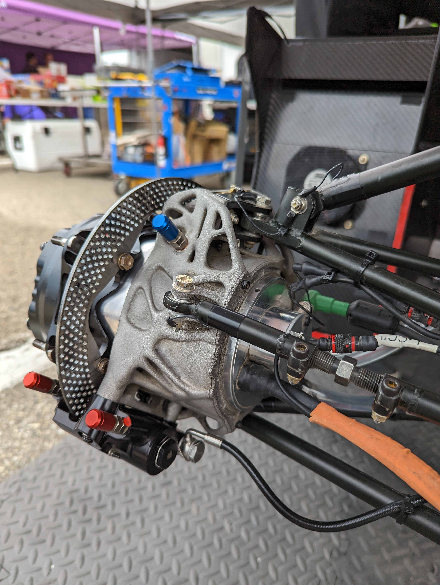
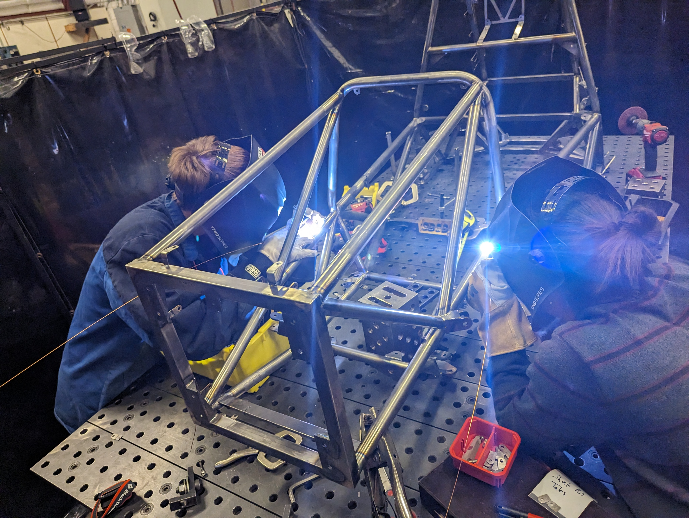
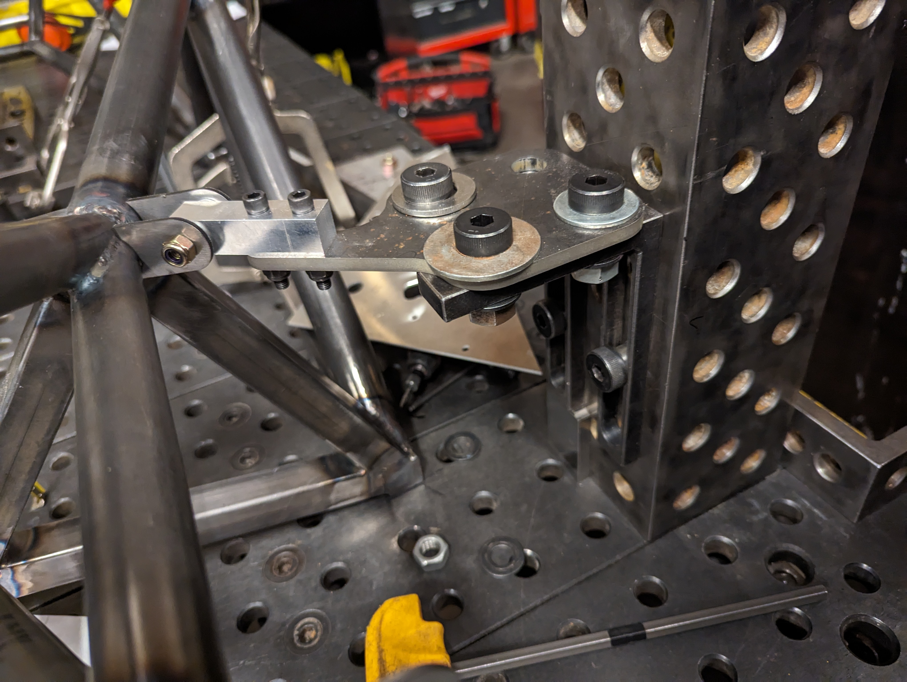
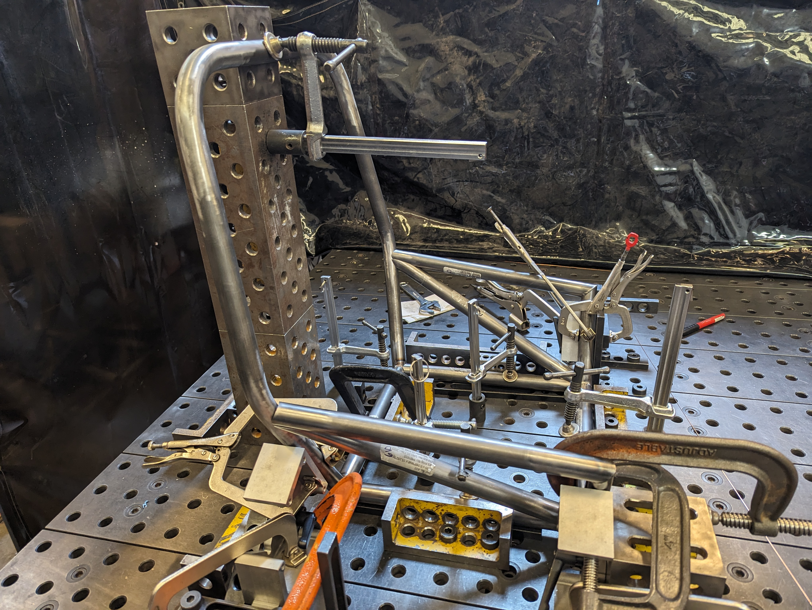
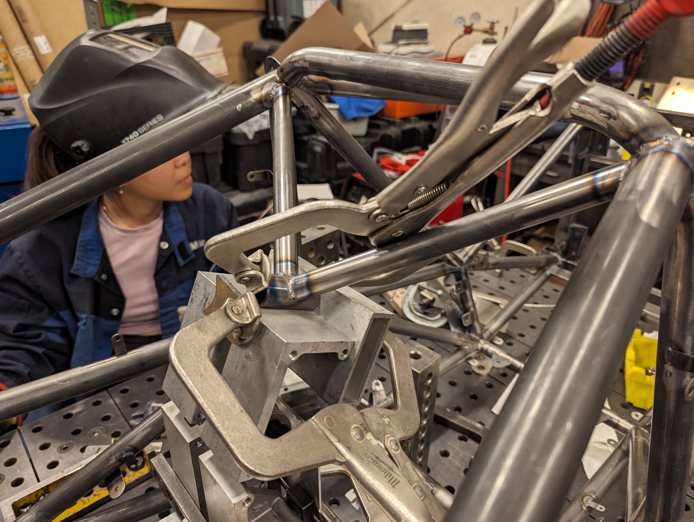

To be a good Formula One driver, you first need to beat your teammate. Nobody else has the same car — they are the one driver you have no excuse for losing to. Unfortunately for Nico Rosberg, his teammate was Lewis Hamilton, his childhood friend and reigning two-time world champion. 

But Rosberg was tired of coming in second. In the 2016 [Spanish GP](https://www.youtube.com/watch?v=gCzkaX2DL7w), Rosberg had the lead, and as Hamilton tried to dart around Rosberg cut him off, forcing Hamilton into the grass where he spun out and sent both cars crashing into the dirt[^1]. They collided again in the 2016 [Austrian GP](https://www.youtube.com/watch?v=ixmGVL4dedI) as they fought for first place.

In an [interview](https://www.espn.co.uk/f1/story/_/id/21271511/nico-rosberg-messed-lewis-hamilton-head-en-route-2016-f1-title) later that season, Rosberg said, 
>"I decided to stop cycling because the leg muscles are among the heaviest things on your body. I lost 1kg as a result that August. One kilo of body weight is 0.04 of a second per lap when the car is at the weight limit. I was on pole at Suzuka by 0.03 seconds. My smaller leg muscles got me on pole." 

Rosberg then won at Suzuka, giving him the points necessary to take the world champion title from Hamilton. He [retired](https://www.bbc.com/sport/formula1/38185846) 5 days after winning the championship.

Nico Rosberg won for the same reason that he crashed. He won by dancing on the edge. Sometimes he fell off the edge and crashed, losing races and risking injury. But if he had stayed clear of the edge he wouldn't have had any chance at all.

Designing a racecar is as precarious as driving one. Lightweight cars are faster, but if even one component is too light, it fails and your car breaks. By doing rigorous calculations, simulation and testing, racecar engineers design parts that are as efficient as possible and just barely strong enough. The fastest car is the closest to its breaking point.

Racing pushes people to their limits too. I found my limit through Formula SAE, a collegiate engineering competition where students around the world build formula-one style racecars. As system leads on MIT Motorsports, my friends and I sacrificed our grades, health, and social life, and endured immense stress and frustration for the car. Sometimes we pushed ourselves too far and burned out, but for some reason we got up and kept going every time.

---

Unpaid suffering is synonymous with the Formula SAE experience. In his book "Racecar: Searching for the Limit in Formula SAE," Matt Brown writes,
>"During one of my seldom trips home, a high school friend asked me why I had chosen, among all of life’s opportunities, to spend all my time on a racecar. I didn’t have an answer for him. I had never thought about it. Amidst all the chaos and stress and frustration, during all the sleepless nights and last minute deadlines, I never asked myself why I was doing it."

The natural takeaway is that Formula SAE teams are full of masochistic workaholics with questionable life priorities. There may be some truth to that, but it's worth exploring why these students care so much about their glorified go-karts.

The "live to work" stereotype describes people who work more than 80 hours a week and are driven by toxic work culture, egotistic addiction to ambition, or taking pride in working longer hours than others. Not exactly the picture of personal happiness and fulfillment. What's more, in many environments, working longer hours actually results in less work getting done. [Studies](https://cs.stanford.edu/people/eroberts/cs181/projects/crunchmode/econ-crunch-mode.html) consistently show that working more than 50 hours a week for an extended period of time cripples productivity to the point that progress actually drops below what it would have been with a 40 hour workweek.

But for most people, working is a means to an end. In other words, they "work to live." In [the short piece](https://archive.is/OczxS#selection-815.0-818.0) "The Work You Do, the Person You Are,"  Toni Morrison describes how working a cleaning job as a child shaped her perspective on work. She was proud of making money to help her parents pay the bills, but the work itself was tedious and painful. When she shared her problems with her father, he told her, 
>"Listen. You don’t live there. You live here. With your people. Go to work. Get your money. And come on home."

Morrison interpreted this as follows:

> **1.** Whatever the work is, do it well—not for the boss but for yourself.
> **2.** You make the job; it doesn’t make you.
> **3.** Your real life is with us, your family.
> **4.** You are not the work you do; you are the person you are.

This attitude is different from "living to work" in two ways: your self-worth is not determined by your work, and that your personal life is more important than your work. Take your work seriously, but remember that you're doing it so that you can go home and do the things that truly make you happy — spending time with family, having fun with friends, and enjoying leisure activities.

---

The problem with work-life balance is the assumption that work and life can't mix. For the sake of argument, let's define work as the things you have to do, including studying for school and doing taxes, in addition to working for money. In the context of work-life balance, life is what you choose to do, like spending time with friends and family. Work-life balance assumes that what you have to do and what you want to do are mutually exclusive. But they don't have to be. 

Something special happens when you do focused work for a long time[^2]. You get addicted. You don't notice it, but you're much more efficient than usual. You're so immersed that work that would normally be tedious is somehow enjoyable. Before you know it, sunlight is pouring through the windows, and you realize you've spent all night working, not because you had to, but because you wanted to. 

If your work is exciting and meaningful, it doesn't feel like work. Work like this makes you feel alive. It defies the diminishing productivity problem — If you love your work, you can work long hours without losing productivity because you're having fun. You'd have trouble finding a professional athlete who doesn't love their job, because pain and effort required to get there is too much for someone who isn't deeply in love with the sport. The way to escape work-life balance is doing work that you love.

---

Unfortunately, it's not that easy to be passionate about work. It has to come naturally. Even if you love your job in theory, usually life gets in the way and working is a drag in practice.

Last summer, I was a mechanical design intern at an amazing robotics company called [Mujin](https://kogappa.com/projects/mujin/). The engineering I got to do was awesome. I was designing complex mechanisms, getting them manufactured, and assembling and testing them myself. On paper, this was my dream job. But after a month of working all day every day I started getting tired of it. Sometimes I wanted to work and sometimes I didn't, but I had to show up on time every day anyway. As an intern, I have friends on the team and I wouldn't be at the company for long enough to see my projects make it to production.

On MIT Motorsports I have full ownership over my projects. As Chassis Lead, the car's frame is my responsibility. I set my own deadlines and I can work on my own terms as long as the frame is built on time for the team to have a functional car. 

My teammates on MIT Motorsports are also my closest friends at MIT. Working together is fun. We joke around and support each other in a way that isn't possible in a typical work environment. We go on ski trips and celebrate holidays together. And most importantly, the late nights in shop and the hard work that everyone put in built up strong camaraderie and mutual respect. 

The third reason I work hard is because I want to win. At last year's competition, we saw the best teams with our own eyes — ETS's beautiful wheel packages[^3], Georgia Tech's 3.6 second acceleration run[^4], and  UW's beautiful monocoque[^5] — and I decided that next year we're going to roll in to the pits with a car like that. It wasn't enough to try our best and learn a lot. We had to be the best.

Designing, building, and testing an electric racecar in a single year is an insane amount of work to do voluntarily. But we aren't getting paid to show up, and nobody is doing it for the career boost[^6]. We did it because cared about the mission and the team. Regardless of what your values are, the key to loving your work is aligning your career with what you care about most.

---

But caring so much about your work risks burning out. Let me explain with a vehicle dynamics analogy. Below is a graph of lateral force vs slip angle. The vertical axis represents how fast the car can turn a corner, and the horizontal axis is how aggressively the driver is steering. The multiple curves show how the tire's performance decreases as the weight on it increases.

Source: Racecar Vehicle Dynamics, Milliken and Milliken

The harder the driver steers, the faster they can corner. But there is a point (the peak of the curves above) where the tires lose grip and start slipping, causing the car to [spin out and crash](https://www.youtube.com/watch?v=9H_CRRmKLrE&ab_channel=F1nalLap). This maximum steering angle depends on many factors that change throughout a race, including weight transfer, speed, and tire temperature. A car has less traction available for steering when it is braking, so you can easily crash by braking too late when approaching a corner. Racecar drivers have to understand the effects of these factors and feel the change in steering wheel force as they turn in order to stay just barely below the limit of the tire's traction[^7].

Similarly, you need to know where your limit is at all times to work as hard as you can. Like a racecar's maximum steering angle, a person's limit depends on many external factors, such as stress, personal circumstances, and health. You need to understand these factors to avoid pushing yourself over the limit. 

Burning out helped me understand where my limit is. In January this year, I had no classes and I worked 100 hours a week for four weeks straight building the frame[^8]. Every day I would wake up, shower, and work all day, eating meals in shop and leaving to go home after midnight. If I did not do this, the car would not have been built quickly enough to be tested and tuned before competition. I remember how I would bike to shop to work on the car wishing that I didn't have to. I cared so much about finishing the frame that I didn't make sure that I was enjoying myself. But hours per week is not the only indicator of where your limit is. While an F1 driver's limit is determined by physics, my limit is affected by deadlines, exams, sleep schedule, and mental health. In the fall semester I was constantly weaving through deadlines, exams, and 9 am lectures, and several times I spiraled out of control and crashed.

You know you're about to crash when work isn't fun anymore. Taking good classes and building a racecar should be exciting. Sometimes, I pulled all-nighters pushing for a deadline and went to sleep the next day questioning if it was worth it. There were other times where I skipped lectures, rushed my problem sets, and crammed for exams at the cost of my understanding of the material. I felt awful. My grades and mental health suffered. These should have been glaring red flags that I've reached my limit and that I need to step on the brakes. You can't win a race if your car is in pieces on the side of the track.

Yet, somehow, when the frame and all the stress, pain, and depression that came with it was done, I didn't regret much. If I could go back to last summer, I'd do some things differently to avoid burning out, but I wouldn't give up. I'd do almost all of it again. 

Life is too short to drive like an Uber driver. Pushing yourself and loving what you do is what makes life exciting. George Barnard Shaw said it best:

> This is the true joy in life, the being used for a purpose recognized by yourself as a mighty one...
> 
> I want to be thoroughly used up when I die, for the harder I work the more I live. I rejoice in life for its own sake. Life is no "brief candle" for me. It is a sort of splendid torch which I have got hold of for the moment, and I want to make it burn as brightly as possible before handing it on to future generations.

To fully appreciate life is to full send it — push yourself to the limit because you love what you do, rather than working just to pay the bills. You might crash, but life is not a single race — it's a thousand races. As long as you don't die, you can learn from your mistakes and keep racing. You grow by getting back up again. Like an F1 driver who has learned exactly how hard he can steer from countless crashes and near misses, pushing yourself teaches you what approaching your limit feels like so that you can slow down before you burn out. Learn to drive fast without crashing. It's better to live this way, dancing on the edge, than to coast your way through every corner of life.

[^1]: [Here](https://www.youtube.com/watch?v=j28f3hhbkI8)'s the footage and Nico Rosberg's explanation of what happened

[^2]:.  Scientists call this [flow](<https://en.wikipedia.org/wiki/Flow_(psychology)>). Tim Urban explains it on his blog ["WaitButWhy"](<["flow"](https://waitbutwhy.com/2013/11/how-to-beat-procrastination.html)>) .

[^3]: Topology-optimized 3D printed titanium uprights with the motor and cooling channels packaged inside. Custom two stage 15:1 planetary gearbox running at 30 kW. Custom brake calipers. No wonder their university is named École de Technologie Supérieure.

  
  
  


[^4]: Georgia Tech's [car](https://www.instagram.com/p/CuTLtgirece/?img_index=2) was the fastest car at competition due to their impeccable traction control and aerodynamics. The acceleration event is a 75 meter sprint, and their car did it in 3.6 seconds. The next fastest was ETS with a 3.8 seconds (not even close by racing standards).

[^5]: A monocoque is where the frame is a single piece made of aluminum honeycomb sandwiched between sheets of carbon fiber. University of Washington's monocoque weighed 50 lbs, while my steel space frame this year weighs 81. UW's car was gorgeous: 


[^6]: Although having FSAE on your resume is a huge boost (I wouldn't have gotten my SpaceX internship without it and the best engineering companies recruit heavily from these competitions), 80% of the time put into Motorsports does not directly advance your career — manufacturing hundreds of parts, teaching other members, planning and management, and other high time commitment low prestige work. You can tell when someone is doing racecar only for their career when they don't want to do unrewarding work. Thankfully, these people tend to quit the team before long.

[^7]: Watch [this video](https://www.youtube.com/watch?v=mSmWP3Oi2aA&ab_channel=F1Jackman) to see how perfectly F1 drivers turn a corner - if Pérez were to brake or steer just a hair more he would have crashed.

[^8]: Some pictures of the frame:

  
  
  
  
  
  

