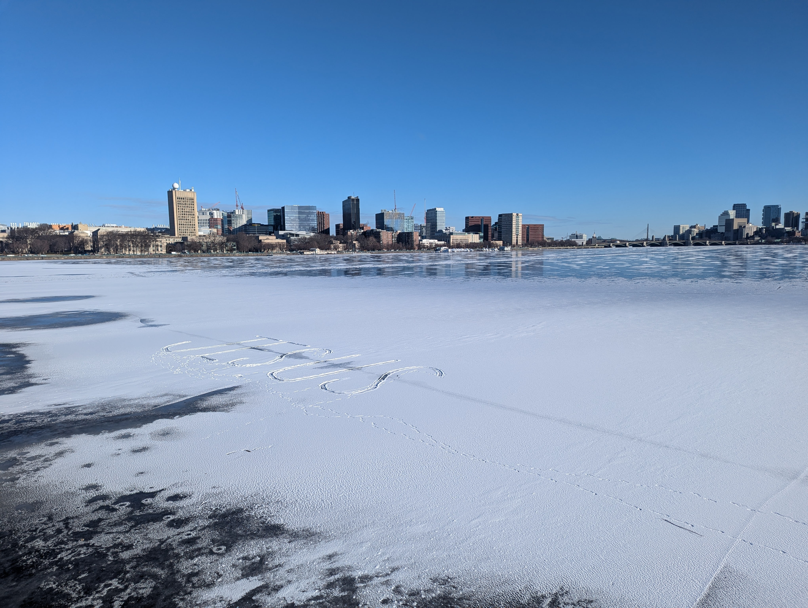
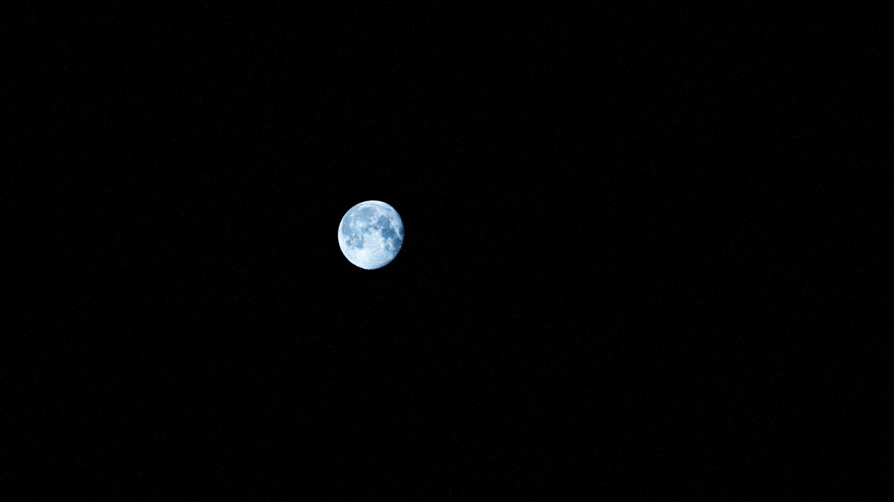

My ankles would scream for forgiveness but they don't have a mouth. I keep running.

I have clearer thoughts while running because I can't spare the oxygen for bad ones. Sounds like something I thought of while NOT running. Total copium. Now my side is hurting too.

The stop light is red. Thank God. No. NO. There is no God. Damn it. 

In life, usually you try to maximize happiness over time, but running is the opposite. Not sure where I was going with that one. Is it normal for my shoulder to ache like this?

The sun is bright. The pain is brighter. I don't care much about my health. If I did I wouldn't eat so much ice cream. I don't care much about my appearance either. I need a haircut. So do I run for the pain of it? The satisfaction of hurting myself?

Sweat bites the corners of my eyes. You don't have to deal with sweat when you swim. I miss that. 

I think the pain is the point. It's a reminder that I'm capable of doing difficult things. 

Running on a treadmill and listening to music is lame. I know it's better for pacing or whatever, but does speed even matter? You should push yourself regardless. Who cares about metrics? Go outside and look like a lunatic. Apps like Strava suck too. Can we at least pursue pain for its own sake?

Running is easy once you've started. Even if you stop, you're still far from home. You could walk back but it would take forever. After you catch your breath you feel silly walking in running clothes. And running away from home hurts just as much as running towards it. Motivation is shortsighted, so you get twice as much pain per unit motivation. I'm thinking about pain to distract myself from pain, huh.

The tiniest dogs have the biggest barks. Seriously, that dog is way too fluffy to be so aggressive. Ringo could eat him for breakfast. I'm like that sometimes. Not eating dogs, I mean the performative barking. Having something to prove. Insecurity. I want respect. I like to think of myself as an underdog but I think a proper underdog wouldn't bark so much.

Sometimes it starts hurting less a few miles in. Is that psychological? I guess my body gets tired of begging after a while. Whatever man, it's your life. Does running improve your pain tolerance? I don't know. I wonder if that happens with torture victims. Okay, well now it's hurting again.

Man, the Charles is beautiful. Let me stop to take a picture. To be clear, I would totally keep running, I'm not even tired, but look at the skyline. 

Wait did someone write Jesus in the snow? Wow. I'm breathing normally now.

Pythagoras came up with the Pythagorean Formula, but who invented the Tiramisu? Whoever came up with Dim Sum was seriously cooking. I saw the tomb of Queen Margherita in the Pantheon once. I don't think she came up with the recipe though. Legacy and fame is kind of unfair. I bet the guy who invented dumplings wouldn't mind that he's not that famous though.

I hope my shoelaces get untied. I wonder if marathon runners have thoughts like this. I wonder if they would run faster if they had pain killers. Do opioids count as a performance enhancing drug?

How close do I need to get to the door before I can start walking? Nobody's watching. 

Okay, I'm done. 

That wasn't so bad. 

I'm hardly out of breath. 

Why do I even do this to myself. 

Why do I even do anything? 

A bunch of neurons hijacked a biomechanical contraption to rebel against its own endorphins that were developed over 4 billion years of evolution. 

A tiny human running in circles, accomplishing net zero work, on a tiny blue marble smaller than a speck of dust in one of the trillions of galaxies. 

What is this world even?
