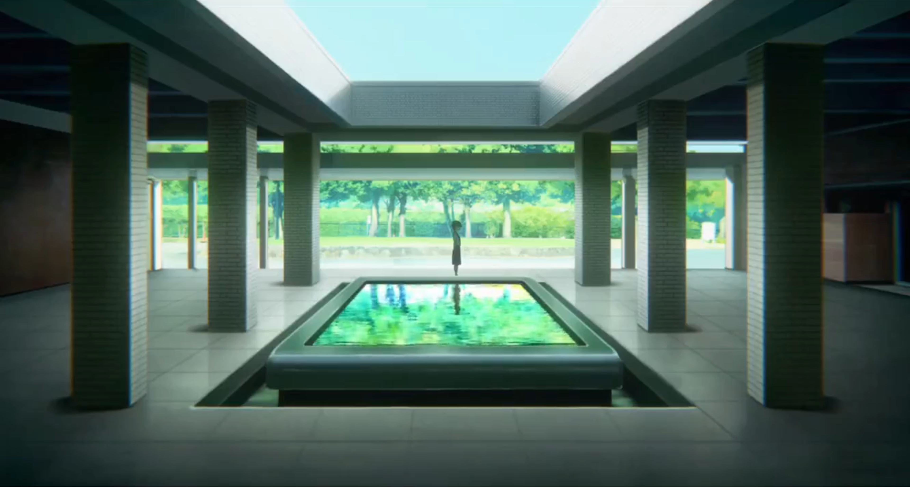
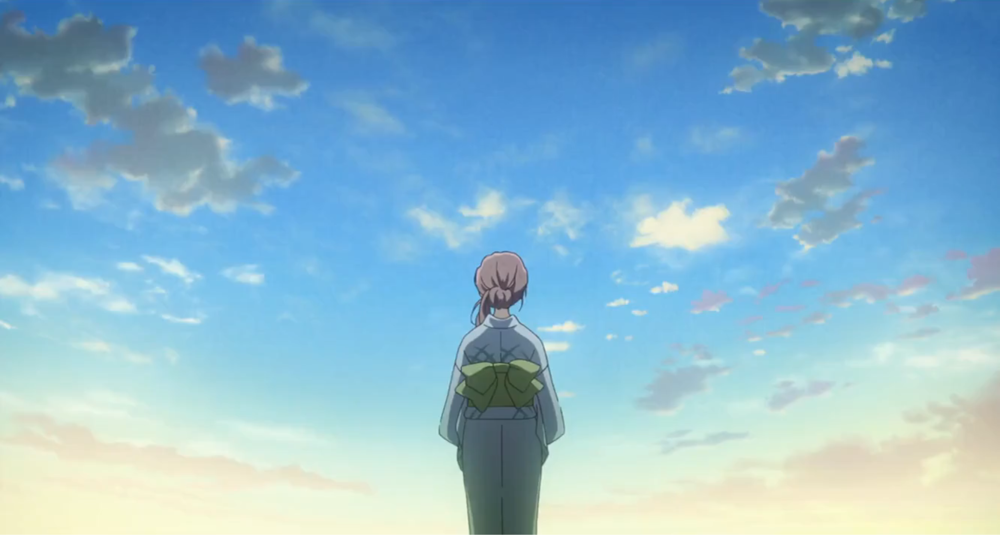
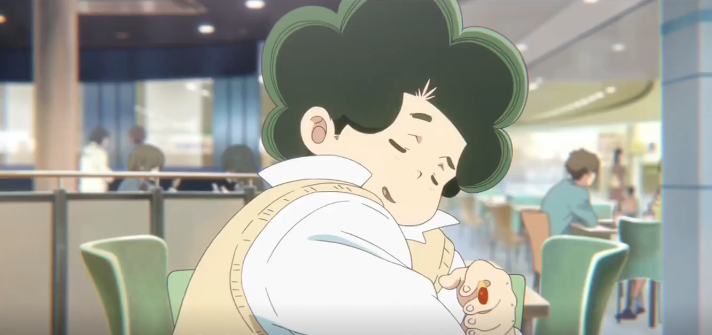
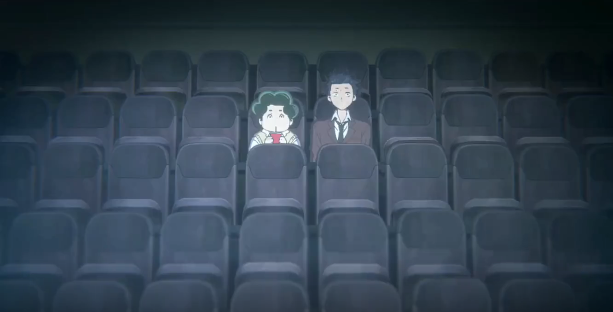

## Intro

Shape of Voice is my favorite movie because it tells a story about overcoming depression more beautifully than anything I've experienced. Let me explain why (without spoilers).

**Sidenote:**
Due to mistranslation, the movie is also known as "A Silent Voice". The Japanese name "Koe no Katachi" directly translates to "Shape of Voice", but I imagine they changed it to "A Silent Voice" because that's smoother, but they didn't change it everywhere so the movie has two names now. It's kinda silly how high-budget anime productions have mistranslated titles. For example, Attack on Titan's Japanese name is Shingeki no Kyojin, which translates directly to "The Attack Titan". The name "Attack on Titan" makes no sense.

## Plot

The story follows Shoya Ishida, who bullied a deaf girl named Nishimiya in middle school. In high school, Ishida struggles with depression and tries to make amends with Nishimiya. The movie is about Ishida learning to make friends, love himself, and enjoy life again.

## Beauty

As usual, I'll start with the music so that you can listen while reading.

I really liked the gentle soundtrack. Here are my favorites:

<iframe style="border-radius:12px" src="https://open.spotify.com/embed/playlist/1rJOgL1YEiirl3KN2y8kXa?utm_source=generator" width="100%" height="352" frameBorder="0" allowfullscreen="" allow="autoplay; clipboard-write; encrypted-media; fullscreen; picture-in-picture" loading="lazy"></iframe>

And the art is stunning:


  
  
  
  


The beautiful illustrations and music help convey the main message of the movie -- what makes life worth living.

## Depression

### Pain
Depression hurts. It's not just being unhappy, it's a deep, physical pain coming from the bottom of your stomach. Shape of Voice depicts this realy well. 


  
  
  
  


### Loneliness

Shape of Voice uses X's to illustrate loneliness. It's a brilliant way to show what it's like to be convinced that everybody dislikes you. It's painful to talk to anybody because your head is full of all the negative things that they're thinking about you.

### Self-hate

Shape of Voice shows how self-hate can lead to hurting people you care about.

This is an important theme because realizing that your depression is hurting others is the first step to understanding that the self-hatred itself is the problem (and not yourself).

### Communication
Many problems related to depression are caused by a lack of communication. Often people don't know what a depressed person is going through because the person bottles everything up or others are unable to understand them. At the same time, the depressed person usually doesn't know how much people care about them because that can also be difficult to communicate. 

If people were able to effectively communicate how much pain they feel to their loved ones, there would be fewer people at funerals wondering what they could have done differently.

Shape of Voice demonstrates these ideas incredibly well through both Ishida's personal struggles and Nishimiya's deafness preventing them from communicating effectively.

## Friendship

> "I think friendship is beyond logic and words. Requirements can kiss my ass."

Shape of Voice also shows what friendship looks like.


  
  
  
  
  
  


The movie shows how the idea that people would be happier without you is completely wrong. People care about you more than you realize.

## Healing

Shape of Voice is a sad movie, but it doesn't have a sad ending. It shows how to overcome depression and find happiness.

This optimistic, uplifting message is why I love Shape of Voice so much. It helps you empathize with people struggling with depression *and* it helps you overcome depression yourself.